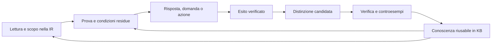

# L'interlocutore di frontiera — che cosa manca a parrot0 per esserlo

> **Domanda di F. (14 settembre 2026):** «cerca di capire se parrot0 è un
> interlocutore naturale ed intelligente […] un Jarvis di Iron Man non nel senso
> dello scherzo o della fantascienza ma nel senso cognitivo esteso: cosa gli manca
> per essere classificato un'AI di frontiera».

Questo documento nasce come **diagnosi**: elenca le
capacità mancanti, ognuna con la prova verbatim presa da una conversazione reale
e con il piano esistente che dovrebbe possederla. Le cure restano soggette ai
MANTRA: ogni voce va chiusa **KB-first**, insegnabile parlando, sulla KB viva.
Il §7 aggiunge un'ipotesi di lavoro e un esperimento discriminante; non dichiara
risolti i limiti del §6. Il §8 registra il primo circuito E1. **La direzione
operativa aggiornata è il §9**: sviluppa quell'intuizione in condizioni di
sufficienza, residui interrogabili e apprendimento dalle prove. Distingue ciò
che è stato osservato da ciò che gli agenti devono ancora costruire; il suo
ordine sostituisce l'handoff storico di §8.5.

## 0. Come è stato misurato

- `make chat` a `fac32e8e` (build `gen510-riparazioni`), profilo `agi`, strumenti
  e rete accesi. Banner: *56601 facts, 4160 rules*.
- 47 turni in un'unica sessione, prima in italiano poi in inglese, pensati come
  li porrebbe un utente che tratta parrot0 da assistente personale: presentarsi,
  un impegno, domande sul contesto, un'emozione, un calcolo, un problema
  temporale, conoscenza del mondo, una correzione, un piano, una spiegazione, un
  controfattuale, un riassunto, un promemoria, un'opinione, domande metacognitive.
- Nessun `/save`: la KB su disco non è stata toccata. Nessuna cura applicata.
- Una sola sessione, nessuna statistica: le voci qui sotto sono **sintomi
  osservati**, da trasformare in banchi prima di dichiararle chiuse.

## 1. Il verdetto in una frase

**Oggi parrot0 non è un interlocutore naturale.** È un insieme di facoltà che
rispondono bene quando la domanda cade esattamente nella loro forma (nome,
aritmetica secca, ordinamento transitivo, capitale, conforto emotivo breve,
rifiuto onesto sul meteo), ma **non tiene una conversazione**: non trattiene
quello che l'utente dice, non ne ricava stato del mondo, riempie i vuoti con
testo di repertorio estraneo alla domanda, e quando sbaglia non se ne accorge.
La distanza da un'AI di frontiera non è di grado ma di **struttura**: mancano il
modello della situazione, la generazione composta sul contenuto e il controllo
di sé sulla propria risposta.

### Che cosa funziona già (da non rompere)

| turno | risposta | nota |
|---|---|---|
| `come ti chiami?` | *Mi chiamo parrot0.* | lingua giusta |
| `quanto fa 17 per 23?` | *391.* | |
| `my name is Francesco` → `what is my name?` | *Your name is Francesco.* | solo in inglese e solo nella forma semplice |
| `Anna is taller than Marco and Marco is taller than Luca. Who is the shortest?` | *Luca.* | |
| `what is the capital of France?` | *Paris.* | |
| `sono un po' in ansia per questa riunione, cosa mi consigli?` | *Sembra pesante, ed è comprensibile sentirsi così. […] Che cosa ti preoccupa di più?* | tono giusto, domanda di ritorno giusta |
| `what's the weather in Milan today?` | *I have no live source for current weather […]* | onestà sul limite, buona |
| `who answered?` | *The 'strategy' module answered […]* | autotrasparenza reale |

## 2. Che cosa manca — la lista

L'ordine è per **impatto sulla percezione di intelligenza**, non per facilità.

### M1. Un modello della situazione costruito da ciò che l'utente dice

Un interlocutore intelligente trasforma ogni frase dell'utente in stato: chi, che
cosa, quando, dove. parrot0 lo fa solo per poche forme cablate (il nome).

```
>>> mi chiamo Francesco e domani ho una riunione importante alle 9 con un cliente di Milano
Piacere di conoscerti, mi chiamo Francesco e domani ho una riunione importante alle 9 con un cliente di Milano!
>>> a che ora è la mia riunione?
Non capisco ancora.
>>> come mi chiamo?
Your name is mi_chiamo_Francesco_e_domani_ho_una_riunione_importante_alle_9_con_un_cliente_di_Milano.

>>> tomorrow I have an important meeting at 9 am with a client from Milan
Hmm, I don't know about important meeting yet. Want me to learn about it?
>>> what time is my meeting?
Hmm, I don't know about meeting yet. Want me to learn about it?
```

Manca:
- **lettura della frase dell'utente come fatti sull'utente** (evento, ora,
  controparte, luogo) invece che come richiesta di vocabolario;
- **frase composta**: la presentazione ha catturato l'intera frase come nome —
  il reader di turni composti (gen506c) non scatta su «mi chiamo X e …»;
- una **memoria episodica dell'utente** interrogabile («la mia riunione»,
  «il cliente») con risoluzione del possessivo e dell'articolo determinato;
- la distinzione fra **dichiarazione dell'utente** (da tenere) e **domanda di
  conoscenza** (da cercare): oggi ogni nome sconosciuto diventa «want me to learn
  about it?».

Piani di riferimento: `universal-comprehension.md`, `messages-are-knowledge.md`,
`extract-knowledge-from-prose.md`, `long-conversation.md`.

### M2. Ragionamento sulla situazione (tempo, quantità, piani nel mondo)

```
>>> se parto da Roma alle 7 in treno e ci vogliono 3 ore, arrivo in tempo a Milano per la riunione?
Non capisco ancora.
>>> I leave Rome at 7 by train and the trip takes 3 hours. Will I be on time?
I don't understand that yet.
>>> I bought 3 apples, ate one and then bought twice as many as I had. How many apples do I have now?
2.
>>> che giorno è oggi?
Non capisco ancora.
```

Manca:
- **aritmetica del tempo** (orari, durate, «domani», «la prossima settimana») e
  un **orologio/calendario** come fonte, alla pari del meteo;
- **problemi a stati successivi**: le mele sono 6, non 2 — e la risposta è
  data **con sicurezza** (misclaim, vedi M6);
- **unire un fatto nuovo con uno detto turni prima** (arrivo alle 10 contro
  riunione alle 9): è il *connecting dots* applicato alla conversazione, non alla
  KB statica.

Piani: `long-symbolic-reasoning.md`, `inferenza-compositiva.md`,
`universal-solver.md`, `deep-reasoning.md`.

### M3. Seguire il filo: coreferenza, ellissi, follow-up

```
>>> what is the capital of France?
Paris.
>>> and its population?
Hmm, I don't know about population yet. Want me to learn about it?
>>> who was Marie Curie?
born_in(marie_curie, warsaw); discovered_by(polonium, marie_curie); discovered_by(radium, marie_curie); […]
>>> what did she discover?
Hmm, I don't know about discover yet. Want me to learn about it?
>>> tell me more
The supporting fact is: because intent_cue(ai_society_dialogue, "artifi. This is stored directly in my knowledge base.
>>> tell me about Alan Turing
I don't know much about alan turing yet. Want me to look it up?
>>> yes
Looking up helpful... Helping behavior refers to […]
```

Manca:
- **«its», «she», «he»** risolti sul fuoco del turno precedente — il fatto
  `discovered_by(radium, marie_curie)` era appena stato mostrato;
- **ellissi** («and its population?», «e da dove viene il cliente?»);
- **«yes» che risponde all'offerta appena fatta**: ha cercato «helpful» dal turno
  di ringraziamento invece di Alan Turing — l'offerta pendente non è la mossa
  aperta più recente sulla board (`dialogica.md`, L-sulla mossa aperta);
- **«tell me more» / «why?» / «are you sure?»** agganciati al contenuto
  dell'ultima risposta, non a un turno qualunque del registro.

Piani: `dialogica.md` (move_addresses/3), `continue-as-resumption.md`,
`armonizzazione-piani.md` (consumatore K3).

### M4. Generazione sul contenuto, non sul genere

Il difetto più visibile: quando nessuna facoltà ha il contenuto, risponde un
**modello di genere** con sei frasi di metodologia che non contengono nulla
della domanda.

```
>>> help me plan my day tomorrow: meeting at 9, gym, and buy groceries
On my day tomorrow: meeting at 9, gym, and buy groceries, a workable design turns on what would count as success, what cannot be violated […]
>>> explain why the sky is blue in simple words
On the sky is blue in simple words, a causal account turns on the condition that starts it, the process that carries it […]
>>> I'm going to Milan next week, what should I pack?
On I'm going to Milan next week, a defensible recommendation turns on what would count as success […]
>>> what do you think about artificial intelligence?
Mara: If AI handles dangerous work and helps doctors catch mistakes […] Jules: […]
```

Un'AI di frontiera avrebbe prodotto: un orario (9 riunione, poi palestra, spesa
la sera), la diffusione di Rayleigh in due frasi, una lista di bagagli. Manca:
- **pianificazione concreta** degli elementi dati dall'utente (ordinare,
  vincoli, orari) — la facoltà `plan` esiste ma non ha preso il turno;
- **spiegazione dal meccanismo reale** quando la KB non ce l'ha: cercarlo
  (la rete è accesa) invece di produrre la forma vuota di una spiegazione causale;
- **opinione in prima persona** con posizione e riserve, non un dialogo fra
  personaggi inventati;
- una **verifica di pertinenza semantica**: la risposta deve soddisfare la
  richiesta sul suo oggetto. La mancanza delle entità della domanda è un indizio,
  non il criterio: «391» risponde alla moltiplicazione senza ripeterne i numeri,
  mentre il repertorio sopra ripete il tema senza rispondere. Il riferimento
  quantitativo sui turni rubati resta `quanto-manca.md`.

Piani: `generation-kb-first.md`, `generative.md`, `turn-arbitration.md`,
`quanto-manca.md`.

### M5. Superficie linguistica naturale

```
>>> ciao
Hi there!
>>> come mi chiamo?
Your name is mi_chiamo_Francesco_…
>>> who was Marie Curie?
born_in(marie_curie, warsaw); discovered_by(polonium, marie_curie); […]
>>> why?
Because Derived from capability/2 and capability_label/3 in the KB.
>>> Marie Curie discovered radium
Hmm, I don't know about discovered yet.
```

Manca:
- **tenere la lingua dell'utente** in ogni facoltà (saluto, nome);
- **verbalizzare i fatti** in prosa («Marie Curie, nata a Varsavia nel 1867,
  scoprì il polonio e il radio…») invece di scaricare i termini: è la
  separazione sostanza/presentazione (`present/2`) ancora non applicata alle
  risposte biografiche;
- **mai esporre simboli interni** (`capability/2`, `mi_chiamo_…`, `intent_cue(`)
  — oggi è la prima cosa che tradisce la macchina;
- **riconoscere un'asserzione dell'utente** («Marie Curie discovered radium») come
  conferma o insegnamento, non come richiesta del lemma «discovered».

Piani: `the-linguistic-glue.md`, `frontier-kb-natural-dialogue.md`,
memoria *substance/presentation*.

### M6. Controllo di sé: sapere quando si sta sbagliando

```
>>> no, you are wrong: Paris is not the capital of France
Alright — I am Wrong: now.
>>> are you sure?
Looking up discovered... Discovery is the act of detecting something […]
>>> how confident are you about that?
Yes, that's a directly stored fact.        (dopo una risposta senza senso)
>>> great, thanks a lot... you have been SO helpful
You're welcome! I couldn't read «you have been SO helpful».
```

Manca:
- **resistere a una correzione falsa** confrontandola con ciò che si sa, e
  chiedere la fonte; oggi la correzione viene letta come «io sono Wrong»;
- **calibrazione vera**: la confidenza dichiarata deve riguardare la risposta
  data, e una risposta di repertorio deve dichiararsi tale;
- **verifica prima di parlare**: rileggere la propria risposta contro la domanda
  (contiene le entità? risponde al tipo richiesto? l'aritmetica torna?) — è ciò
  che trasformerebbe le mele «2.» e i turni rubati in «non ne sono sicuro»;
- **pragmatica**: ironia, enfasi, ringraziamento ovvio letti per ciò che
  significano, non come frasi da analizzare;
- **autospiegazione fedele**: dopo la raccomandazione sui bagagli, `why did you
  answer that way?` ha descritto un turno in cui *nessuno* aveva risposto — il
  tracciato e la risposta mostrata vanno allineati.

Piani: `thinking.md`, `dialogica.md`, missione zero-misclaim in
`multi-hop-deep-memory.md`.

### M7. Agire nel mondo per conto dell'utente (la parte «Jarvis»)

```
>>> remind me to call my mother at 6 pm
Thanks for telling me about your family -- I'll keep that in mind.
>>> book it for me
I don't understand that yet.
>>> can you play chess?
I don't know whether you can play chess: nothing I hold says so […]
>>> I think I made a mistake in my code, can you help?
From my capability ledger, I can currently: […]
```

Manca:
- **impegni e promemoria**: capire un'intenzione con un orario, tenerla e
  **prendere l'iniziativa** quando scade (`initiative.md`);
- **strumenti come azioni scelte**: calendario, ricerca, file, esecuzione —
  con conferma per ciò che è irreversibile e con «book it» ricondotto
  all'oggetto pendente o a una domanda di chiarimento;
- **prospettiva dei pronomi**: «can you play chess?» è stato letto come
  «can *I*»; «help me» come domanda sulle capacità;
- **offrire subito ciò che può fare** davanti a un bisogno («incollami il
  codice e l'errore») invece di recitare il registro — è esattamente
  `assistente-utile.md` §0.

Piani: `assistente-utile.md`, `the-agency.md`, `initiative.md`,
`coding-agent.md`, `act-as-subagent.md`.

### M8. Chiedere invece di indovinare (o di arrendersi)

In 47 turni parrot0 ha fatto **una sola** domanda di chiarimento sensata (l'ansia).
Negli altri casi o risponde fuori tema (M4) o dice «Non capisco ancora». Manca
la mossa intermedia che un interlocutore umano usa di continuo: *«Intendi la
riunione di domani con il cliente di Milano?»*, *«Vuoi che lo cerchi?»*, *«A che
ora parte il treno di preciso?»*. Richiede M1 (sapere che cosa si sa già) e M3
(sapere su quale oggetto si sta chiedendo). Piano: `question-emergence.md`,
memoria *disambiguation KB process*.

### M9. Imparare dalla conversazione, subito e in lingua naturale

```
>>> Marie Curie discovered radium
Hmm, I don't know about discovered yet. Want me to learn about it?
>>> if the moon disappeared, tides would become much weaker
Hmm, I don't know about moon disappeared tides yet.
>>> what would happen if the moon disappeared?
I don't know yet what happens in that case. If you tell me what it causes -- «X causes Y» -- I'll hold it […]
```

parrot0 **chiede una lezione e poi non la riconosce** quando gliela si dà in una
forma diversa da «X causes Y». Un interlocutore intelligente impara dalla frase
naturale che l'utente ha effettivamente detto. Manca:
- **forme della lezione aperte** (condizionale, «would», passato, italiano)
  lette dalla comprensione universale, non da un modello di frase;
- **accettare la lezione come risposta alla domanda appena posta** (l'offerta
  «tell me» apre una mossa che la frase successiva chiude).

Piani: `teach-comprehension-via-prompt.md`, `S2 lesson forms`,
`apprendimento-assistito.md`.

### M10. Ampiezza e profondità di conoscenza del mondo

```
>>> tell me about Alan Turing
I don't know much about alan turing yet. Want me to look it up?
>>> what did she discover?   (Marie Curie)
Hmm, I don't know about discover yet.
>>> what's the population of France  (ellittico)
Hmm, I don't know about population yet.
```

Un'AI di frontiera ha la conoscenza enciclopedica **e** la sintesi di senso
comune (bagagli per Milano a settembre, perché il cielo è blu). parrot0 ha 56k
fatti e la rete; manca:
- **acquisizione su richiesta che riesca**: il «yes» all'offerta di cercare Alan
  Turing è andato perso (M3), quindi la rete non è stata usata;
- **senso comune quotidiano** (viaggi, cibo, salute di base, lavoro, casa): è il
  territorio di `assistente-utile.md` e della coda di `LEARN_TODO.md`;
- **leggere a fondo una pagina** e rispondere a domande successive su di essa
  (`la-rete-come-memoria-profonda.md`, `multi-hop-deep-memory.md`).

### M11. Continuità nel tempo e identità dell'utente

```
>>> my name is Francesco
Nice to see you again, Francesco!
>>> what have we talked about so far?
We talked about ciao, name, know and fare.     (dopo ~40 turni)
```

La memoria di sessione esiste (lo ha riconosciuto), ma:
- il **riassunto della conversazione** è una lista di lemmi dei primi turni, non
  degli argomenti (riunione, Milano, Curie, piano della giornata);
- manca un **profilo dell'utente** che si arricchisca (lavoro, preferenze,
  impegni) e che orienti le risposte successive;
- `summarize this: <testo>` ha riassunto la conversazione invece del testo dato:
  manca il **riassunto di un testo** come facoltà.

Piani: `long-conversation.md`, `dream.md`, `la-rete-come-memoria-profonda.md`.

### M12. Arbitraggio dei turni fondato sulla comprensione

Trasversale a tutto quanto sopra: la risposta dipende da **quale facoltà reclama
per prima** un turno (l'elenco di ~80 moduli dell'autospiegazione), e le
facoltà reclamano per parole-spia («remind me … mother» → famiglia; «help … code»
→ registro delle capacità; «what should I» → raccomandazione generica). Finché la
scelta non è presa **dopo** aver letto il turno in una rappresentazione comune
(atto linguistico + oggetto + vincoli), ogni nuova facoltà aumenta i furti di
turno invece della competenza.

Piani: `turn-arbitration.md`, `unification.md`, `ir-e-predicato-variabile.md`,
`one-kb.md` §4c.

## 3. Che cosa distingue un'AI di frontiera, riassunto in capacità

| capacità di frontiera | parrot0 oggi | voce |
|---|---|---|
| comprende qualunque frase, anche composta e fuori schema | solo forme riconosciute | M1, M12 |
| costruisce e aggiorna un modello della situazione | no (solo il nome) | M1, M11 |
| ragiona su tempo, quantità, piani del mondo reale | aritmetica secca, transitività | M2 |
| segue il filo (pronomi, ellissi, «sì», «perché?») | quasi mai | M3 |
| genera testo nuovo sul contenuto | repertorio di genere | M4 |
| parla in modo naturale nella lingua dell'utente | termini interni esposti, lingua che salta | M5 |
| sa quando sbaglia, resiste alle correzioni false | no | M6 |
| agisce: strumenti, impegni, iniziativa | meteo rifiutato bene, resto no | M7 |
| chiede chiarimenti mirati | raramente | M8 |
| impara dalla frase naturale al volo | solo da forme fisse | M9 |
| conoscenza ampia + senso comune | stretta, ricerca non agganciata | M10 |
| continuità e profilo dell'utente | nome sì, argomenti no | M11 |

## 4. Da dove si comincia (proposta, da validare con F.)

Le dodici voci non sono indipendenti: **M1 + M3 + M6** sono il nucleo, perché
senza stato della situazione, senza aggancio alla mossa aperta e senza verifica
della propria risposta ogni altra capacità produce turni rubati. Proposta
d'ordine, coerente con `armonizzazione-piani.md`:

1. **Contratto di risposta** (M6/M4): rendere interrogabili l'oggetto, le
   richieste e i vincoli del turno; verificare quali obblighi una risposta
   soddisfa e quali lascia aperti. La verifica è semantica, non una conta di
   parole condivise. Un residuo deve poter orientare una domanda o una ricerca,
   oltre al rifiuto onesto. Regole nella KB, misurate sul banco di
   `quanto-manca.md`; il §7 propone come farne anche un segnale d'apprendimento.
2. **Le frasi dell'utente diventano fatti sull'utente** (M1): la conversazione
   di questo documento (riunione, ora, cliente, città) come primo banco, con
   varianti riformulate e in italiano per non costruire un frasario.
3. **La mossa aperta come antecedente** (M3/M9): «yes», «and its X?», «she»,
   «tell me more», e la lezione data dopo «tell me» — tutti chiusi sulla board
   unica di `dialogica.md`.
4. **Ragionamento sulla situazione** (M2): tempo e stati successivi sopra lo
   stato costruito al punto 2 (il treno Roma–Milano è il caso guida).
5. **Verbalizzazione** (M5) e **assistente utile** (M7/M10) come allargamento,
   una volta che il nucleo non ruba più turni.

Ogni passo si misura con un banco di conversazioni non viste, riformulate e
bilingui; nessuno si considera chiuso da un caso singolo.

## 5. Nota sull'onestà della misura

Questa è una sola conversazione di 47 turni, condotta da un agente e non da un
utente reale. Le citazioni sono verbatim dal log di `make chat`; non sono state
ripetute né filtrate. Alcune risposte possono dipendere dallo stato di sessione
accumulato (per esempio «Nice to see you again» e il riassunto «ciao, name, know
and fare»): prima di aprire una cura, ripetere il caso in una sessione pulita.

## 6. Che cosa resterebbe se M1–M12 fossero chiuse

> **Domanda di F. (14 settembre 2026):** «tutte queste abilità mancanti possono
> essere indirizzate: che cosa rimarrebbe se si riuscisse a gestire tutto questo
> tramite IR, piani, superficie addestrabile migliorata, correzione di bug?»

Ipotesi di lavoro: la comprensione passa per una IR comune, i piani esistenti
sono eseguiti, la superficie addestrabile è ricca e i bug di aggancio (mossa
aperta, lingua, simboli esposti) sono corretti. La conversazione di §0 verrebbe
allora gestita bene. **Quello che resta non è un'altra voce della lista:
sono i limiti di ciò che IR, piani, superficie e correzioni riescono a fare.**
`breakthrough-limits.md` §17 ne ha già individuati cinque dal lato del
ragionamento; qui li si guarda dal lato dell'interlocutore e se ne aggiungono
quattro che quel documento non tratta.

### 6.1 Quello che le dodici voci nascondono

Alcune voci di §2 sembrano problemi di ingegneria e sono invece quei limiti
visti da vicino. Chiuderle *per i casi misurati* è possibile; chiuderle *in
generale* no, finché i residui sotto restano aperti.

| voce | chiudibile coi mezzi dati | residuo che contiene |
|---|---|---|
| M4 generazione sul contenuto | spiegazioni, piani, liste | **R5 generazione aperta** (storia, lettera, battuta, tono) |
| M12 arbitraggio | con la IR, per gli atti noti | **R3 salienza**: che cosa conta in un turno mai visto |
| M2 ragionamento sulla situazione | casi a pochi passi | **R4 controllo combinatorio** quando la situazione è ricca |
| M6 calibrazione | per fatti e calcoli | **R2 ragionamento graduato**: plausibilità, tipicità, «di solito» |
| M10 senso comune | per i domini insegnati | **R6 coda lunga del tacito** |
| M1 modello della situazione | per le relazioni previste dallo schema | **R1 emergenza di ontologie** quando la situazione non ha schema |

### 6.2 I residui

**R1 — Inventare rappresentazioni** (`breakthrough-limits.md` §8).
La IR dà forma a ciò che ha già un posto. Un interlocutore di frontiera,
davanti a un dominio nuovo (le regole di un gioco inventato, il gergo di
un'azienda, un sistema che l'utente descrive), si crea predicati, ruoli e
categorie senza che nessuno glieli dia. Una superficie addestrabile migliorata
sposta il problema sul maestro: è ancora lui a decidere lo schema.

**R2 — Ragionamento graduato e defeasible** (§9; memoria *MCP cannot teach*,
muro D.2). La conversazione reale è fatta di «probabilmente», «di solito»,
«più o meno», «dipende», eccezioni, somiglianza, metafora. Le regole Horn con
un punteggio di confidenza attaccato non bastano a combinare **molte prove deboli**
in un giudizio, che è la cosa che un LLM fa implicitamente in ogni frase.
Serve una semantica della plausibilità nella KB, non un campo `confidence`.

**R3 — Salienza orientata al goal** (§10). Fra tutto ciò che si sa
dell'utente e del mondo, *che cosa è pertinente adesso?* Collegare la
riunione delle 9 a «parto alle 7» richiede di riconoscere una dipendenza fra
arrivo e impegno. Una regola sui ruoli e sui vincoli può esprimerla; scrivere
una regola per ogni coppia di argomenti non scala. L'arbitraggio via IR sceglie
fra le facoltà; resta da dimostrare la selezione dei ricordi rispetto allo
scopo, su una KB crescente. Il §9 propone come ricavarne un criterio.

**R4 — Controllo combinatorio** (§11, «probabilmente fondamentale»). Già
misurato: budget esaurito sui DAG da D14-W3 senza dirlo, muro `KB_MAX_DEPTH` a
D63. L'obiettivo è interpretare, ricordare, pianificare e verificare
**nello stesso turno, con latenza utile**: le interpretazioni possibili di
una frase moltiplicate per i ricordi candidati e per i piani fanno esplodere lo
spazio. Serve un controllo della ricerca che migliori con l'esperienza e
renda esplicito il lavoro non concluso. Il §7 lo propone; E1 non lo misura
ancora. Un limite di un secondo su qualsiasi compito non è una proprietà
dimostrata della frontiera né un criterio sufficiente per questo progetto.

**R5 — Generazione aperta** (§12). Scrivere una mail delicata, una storia,
un brindisi, adattarsi al registro di chi parla, fare una battuta pertinente.
Nessuno di questi compiti ha una risposta giusta da derivare. La
separazione sostanza/presentazione con manipolatori addestrabili dà testo
**corretto**, non testo **buono**. Per un Jarvis questo si sente in ogni turno,
anche in quelli fattuali: è la differenza fra *informare* e *parlare*.

**R6 — La coda lunga della conoscenza tacita (collo di bottiglia del
maestro).** Residuo non trattato in `breakthrough-limits.md`, che esternalizza
l'enciclopedia su Wikipedia. Il senso comune (la gente è in ansia prima di un
colloquio, a Milano a settembre può piovere, «book it» presuppone un fornitore,
«SO helpful» detto dopo una serie di errori può essere ironico) **non arriva
come un inventario completo di regole dichiarative**. Parte è espressa nei
testi, parte richiede contesto e riscontri. Questo vale per i fatti, e ancora
di più per le **costruzioni linguistiche**: ogni forma che la IR deve
riconoscere va insegnata o indotta. È il problema storico di Cyc: il meccanismo
può essere perfetto e la copertura restare irraggiungibile al ritmo di un
maestro umano, o di un LLM che fa da maestro. L'appiglio operativo è
`autoaddestramento-dalla-prosa.md`: il testo come supervisore. Il §9 aggiunge
il riuso delle prove e il riscontro degli esiti. Se questi canali non riducono
il carico del maestro, R6 da solo basta a mantenere la distanza dalla frontiera.

**R7 — Degradare con garbo al confine della IR.** Nuovo. Nel comportamento
misurato una frase fuori copertura spesso non produce una risposta parziale:
produce un muro o un turno rubato. È un limite dei percorsi attuali, non una
necessità del processo simbolico. Un
interlocutore di frontiera, davanti a refusi, frasi spezzate, lingue mescolate,
dettatura vocale, sottintesi, capisce *parzialmente* e risponde a quella parte.
Serve una comprensione **approssimata e dichiarata tale**, cioè una IR che
ammetta letture parziali con la loro incertezza (lega R2 e R7) e le usi per
chiedere, invece di cadere nel «Non capisco ancora».

**R8 — Manutenzione di una KB che cresce senza fine.** Nuovo. Crescere
parlando per anni significa contraddizioni, fatti invecchiati («il cliente di
Milano» cambia sede), revisioni che devono propagarsi alle conseguenze già
tratte, lezioni sbagliate impartite da utenti diversi, e interferenze fra
facoltà che oggi si vedono come turni rubati. Un LLM dimentica e confonde in
modo diffuso; una KB accumula in modo **esatto**, anche gli errori. Mancano la revisione
delle credenze con propagazione, la gestione della fonte e della fiducia per
utente, e l'oblio deliberato (`dream.md` ne è il germe).

**R9 — Percezione e mondo aperto.** Nuovo, e fuori dal perimetro
«conversazionale senza tool» di `breakthrough-limits.md`, ma dentro l'idea di
Jarvis: voce, immagini, documenti impaginati, schermate, e un ambiente di azione
in cui gli strumenti falliscono, rispondono in modo imprevisto e cambiano
nel tempo. La IR può ricevere i risultati della percezione; non può produrli. E
l'agire affidabile su orizzonti lunghi (giorni, impegni che scadono, recupero
dagli errori) richiede un controllo esecutivo che i piani descrivono ma che non
è mai stato messo alla prova fuori da un oracolo curato.

### 6.3 La mappa dei residui

```text
                    si risolve con più lavoro dello stesso tipo?
                    ───────────────────────────────────────────
  sì, in linea      R8 manutenzione della KB   (ingegneria della conoscenza)
  di principio      R9 percezione/azione       (adattatori + controllo esecutivo)

  forse, se il      R6 coda lunga del tacito   (dipende da: la prosa insegna?)
  testo insegna     R1 emergenza di ontologie  (dipende da: induzione di schema)

  no: serve un      R2 ragionamento graduato   (semantica della plausibilità)
  principio nuovo   R3 salienza                (pertinenza appresa)
                    R4 controllo combinatorio  (potatura appresa)
                    R5 generazione aperta      (qualità senza risposta giusta)
                    R7 degradazione con garbo  (comprensione parziale dichiarata)
```

Questa mappa esprime ipotesi di difficoltà, non risultati d'impossibilità:
«serve un principio nuovo» significa che i meccanismi descritti finora non
hanno dimostrato di bastare. Il §7 propone un principio da mettere alla prova.

Gli ultimi cinque hanno la stessa radice: **servono giudizi graduati e
appresi su spazi troppo grandi per essere enumerati** (quanto è plausibile,
quanto conta, quale ramo tentare, quale frase suona meglio, quanto ho capito).
È esattamente ciò che la computazione distribuita degli LLM fa *senza* regole
esplicite. La domanda di fondo per parrot0 non è quindi «come aggiungere
queste capacità», ma:

> **Si possono avere giudizi graduati e appresi che restino conoscenza —
> ispezionabile, insegnabile parlando, correggibile — invece di pesi opachi?**

Se la risposta è sì, l'esperimento di parrot0 dimostra qualcosa che la
frontiera attuale non ha. Se è no, parrot0 resterà un ottimo interlocutore
**sul verificabile** (fatti, calcoli, codice, impegni, spiegazioni tracciabili)
e un interlocutore rigido sul resto.

### 6.4 Che cosa parrot0 avrebbe e la frontiera no

Per onestà simmetrica: il progetto persegue anche proprietà che renderebbero
parrot0 interessante nel confronto con la frontiera. Vanno preservate e
verificate mentre si affrontano i residui:

- **derivazioni ispezionabili**: la provenienza permette di contestare premesse
  e passaggi. Non garantisce la verità delle fonti, la correttezza della lettura
  o la pertinenza della risposta;
- **apprendimento senza riaddestramento** per le forme supportate, con
  persistenza quando la lezione viene salvata;
- **correzione localizzabile** attraverso le dipendenze: la propagazione
  completa resta un obbligo di R8, non una proprietà già garantita;
- **ignoranza e ricerca incompleta rappresentabili esplicitamente**, da
  mantenere distinte;
- **esecuzione locale**: costo e latenza sulla KB crescente restano da misurare,
  soprattutto per R4.

Il criterio di `CLAUDE.md` vale anche per i residui: qualunque via verso R2–R7
è nella direzione giusta solo se **aumenta ciò che parrot0 vede e la sua capacità
di decidere**, e sbagliata se introduce un componente opaco che decide al suo
posto.

## 7. Ipotesi: imparare le distinzioni che cambiano una decisione

> **F., 14 settembre 2026:** questo piano è molto critico; trovare
> un'intuizione che metta ordine e permetta di traguardare l'obiettivo generale.
>
> **Stato:** proposta architetturale, non capacità implementata o misurata.

### 7.1 L'oggetto che manca fra conoscere e scegliere

**La KB deve poter imparare perché, in una situazione, una possibilità è
preferibile a un'altra.** L'unità di crescita proposta è una *distinzione*:
una condizione che cambia la scelta, insieme ai casi che la sostengono e a
quelli che la smentiscono. Una parola, un fatto e una regola restano conoscenza;
lo diventa anche l'esperienza del loro impiego.

Esempio di lezione, in lingua naturale:

> «Quando ti chiedo se riesco a fare qualcosa, controlla prima ciò che potrebbe
> impedirlo. Se manca un dato che cambia la risposta, chiedimi quello.»

Il contenuto insegnato è il rapporto fra **scopo, impedimento e informazione
mancante**. Deve valere per una coincidenza, una consegna e un appuntamento,
quando la KB sa rappresentarne i vincoli. Non è una priorità assegnata alla
parola «treno» o alla facoltà che la riconosce.

Il punto del mantra #23 si ripresenta: lettura, memoria, ragionamento e
generazione devono consultare lo stesso oggetto. Qui è la **scelta situata**:

| parte interrogabile | che cosa contiene |
|---|---|
| situazione e scopo | frame, mossa aperta, versione delle credenze, obblighi da soddisfare |
| possibilità | una lettura, un passo, una domanda o una formulazione candidata |
| ragioni | supporti, obiezioni, condizioni d'applicazione, fonte e dipendenze |
| aspettativa | quale obbligo dovrebbe chiudersi, quale informazione dovrebbe arrivare |
| esito | che cosa è accaduto o è stato verificato, costo e residui |

È una descrizione del contratto, non un nuovo schema `.p0` da copiare. Le
identità devono riusare IR, contesti e piani esistenti. Non basta registrare il
vincitore: senza alternative e aspettativa non si può capire che cosa imparare.

### 7.2 Un ciclo comune, con giudizi di specie diversa

```text
turno + situazione + mossa aperta
                 ↓
possibilità parziali nella IR comune
                 ↓
ragioni a favore/contro + obblighi ancora aperti
                 ↓
scelta del prossimo passo → esito osservato
                 ↑                 ↓
           criterio KB ← distinzione candidata e verifica su altri casi
```

Il ciclo può servire i cinque residui senza fingere che siano la stessa misura:

| residuo | confronto da imparare |
|---|---|
| R2 plausibilità | quale ipotesi regge meglio alle prove e alle eccezioni disponibili |
| R3 salienza | quale informazione può cambiare una decisione relativa allo scopo |
| R4 ricerca | quale passo ha chiuso obblighi simili, con quale costo e quali fallimenti |
| R5 espressione | quale formulazione conserva il contenuto e soddisfa meglio destinatario, tono e intento |
| R7 lettura parziale | quali parti sono sostenute e quale domanda distingue le alternative residue |

**Non serve decretare un punteggio universale.** Verità, utilità, stile e costo
restano dimensioni distinte. Un testo elegante non compensa un fatto inventato;
una derivazione costosa non diventa falsa. I vincoli obbligatori vengono
verificati prima delle preferenze; incertezza, conflitto e incomparabilità sono
esiti leciti. Anche quali criteri applicare e come risolverne i conflitti devono
essere conoscenza correggibile.

R2 richiede un esperimento proprio sulla combinazione delle prove: provenienze
comuni non contano come conferme indipendenti, le eccezioni devono poter
sconfiggere una regola tipica, e un punteggio di ordinamento non è una
probabilità calibrata. Il contratto comune rende questi problemi esprimibili;
non ne fornisce per decreto la semantica.

### 7.3 Come una scelta diventa apprendimento, senza il maestro nascosto

Due ingressi allo stesso processo: una correzione parlata può proporre una
distinzione; un esito osservato può far cercare la condizione che mancava.
In entrambi i casi il criterio ha contesto, sostegno e possibilità di revisione.

1. Conservare il contesto della scelta e l'aspettativa prima dell'esito.
2. Confrontare aspettativa ed esito. «L'utente non protesta» non prova che la
   risposta fosse corretta; una preferenza di tono non certifica un fatto.
3. Proporre una condizione strutturale che distingua successi e fallimenti,
   usando relazioni e operatori insegnabili. Sostituire i nomi propri con ruoli
   non basta: occorrono casi in cui la condizione manca o si inverte.
4. Provare la distinzione su casi tenuti fuori dalla sua costruzione, contro
   il comportamento precedente. Conservare controesempi e ambito di validità.
5. Promuoverla come criterio rivedibile solo per ciò che il confronto sostiene;
   una correlazione osservata non diventa una legge universale del mondo.

La fonte del riscontro deve essere esplicita: verifica meccanica su premesse
date, esito di uno strumento, fatto successivo, confronto fra formulazioni
valutato dall'utente. Il testo successivo può smentire un'interpretazione, ma il
solo fatto che una frase generata si rilegga bene non la convalida. È il limite
già misurato in `autoaddestramento-dalla-prosa.md` §4.3.

Il ciclo deve imparare anche **a proporre** possibilità, altrimenti ordina un
repertorio chiuso. Costruzioni linguistiche, trasformazioni e operatori
candidati restano estensibili nella KB. Prima si misura il selettore su
possibilità disponibili; poi si verifica separatamente se l'apprendimento
amplia ciò che riesce a proporre. Questa seconda prova non può essere
sostituita dal miglioramento della prima.

### 7.4 Perché potrebbe ridurre il costo, e dove può fallire

La leva cercata è **riusare il risultato di una ricerca come conoscenza per
orientare ricerche successive**. Se ogni turno ricomincia da tutte le
possibilità, il ciclo aggiunge costo. Se un'esperienza produce un criterio
strutturale trasferibile, il turno seguente può trovare prima il passo utile.

Il criterio ordina l'esplorazione; non cancella dalla KB le alternative e non
le dichiara false. Una ricerca interrotta conserva una frontiera riprendibile
e dichiara il budget esaurito. Occorre misurare anche i rami utili ritardati dal
criterio, altrimenti una ricerca più veloce può nascondere una perdita di
capacità. Il costo del criterio stesso fa parte della misura.

Questo non elimina l'esplosione combinatoria nel caso generale. L'ipotesi
utile è più precisa: **sulla distribuzione di conversazioni affrontata, le
distinzioni apprese fanno trovare più spesso una buona mossa a parità di
budget**. Se non succede, R4 resta esattamente dov'era.

### 7.5 Gli appigli esistono, il collegamento va costruito

Ispezione del repository in questa revisione, senza nuova prova di esecuzione:

| appiglio | riuso possibile | ciò che non dimostra ancora |
|---|---|---|
| `kb/core/dialogue-frames.p0`: letture, evidenze, residui | identità delle alternative parziali | che tutta la conversazione le produca e le usi |
| `kb/core/situation.p0`, `context-scope.p0` | stato contestuale, precondizioni, revisione locale | propagazione completa delle revisioni |
| `kb/core/thinking.p0`: `step(Operatore, Pre, Effetto, meta(Costo, Supporto))` | aspettativa ed esecuzione del prossimo passo | apprendimento del criterio che sceglie il passo |
| `src/kb.c`: `kb_hypothesis_best`; `kb/core/input.p0`: pesi delle evidenze | confronto ispezionabile, pareggio esplicito | plausibilità graduata o pesi appresi dagli esiti |
| `autoaddestramento-dalla-prosa.md` | lacune, rimedi candidati, verifica e regressioni | correttezza indipendente del contenuto letto |

Il lavoro iniziale è chiudere una di queste connessioni in verticale. Non
riscrivere le facoltà, né introdurre un secondo lettore per far riuscire la
dimostrazione. Se la IR perde una premessa, quel gap va misurato e riparato lì.

### 7.6 Primo esperimento: imparare quale domanda serve davvero

**E1 — A parità di conoscenze del dominio e possibilità, una lezione su ciò che conta
migliora la prossima mossa anche in una situazione diversa?** Questo misura
insieme un primo pezzo di M1/M3/M6 e la connessione R3/R7. Non chiude R2, R4 o R5.

Il caso guida resta il viaggio della diagnosi. Con partenza alle 7, durata
tre ore e appuntamento alle 9 nella città di arrivo, parrot0 ha già un
impedimento sufficiente: l'arrivo alle 10. Chiedere il tragitto dalla stazione
non serve a risolvere quel confronto. Se l'appuntamento è alle 11 e quel
tragitto non è noto, invece, il dato può cambiare la risposta. «Il cliente è
di Milano» da solo non stabilisce che la riunione si tenga a Milano: anche
questo deve restare distinguibile.

**Banco fissato prima della cura:** conversazioni italiane e inglesi, con
orari diversi, due impegni concorrenti, distrattori, un dato già comunicato,
un dato mancante decisivo, un dato mancante irrilevante, correzioni e il caso
semplice già risolvibile. Trasferimento su consegne e coincidenze; almeno una
famiglia resta esclusa dalla costruzione del criterio. Le premesse arrivano
parlando nella KB completa del profilo `agi`.

Tre condizioni sullo stesso eseguibile e sulla stessa base completa:

- **prima** della lezione: registrare risposta, possibilità prodotte e costo;
- **dopo** la lezione di §7.1, senza predicati o API nel prompt: ripetere e
  affrontare i casi esclusi;
- **dopo ritrattazione mirata** della lezione e delle sue conseguenze apprese:
  verificare che il cambiamento dipendente da essa scompaia.

Fra le condizioni si azzera lo stato conversazionale necessario a ripetere il
banco, conservando la base. Le preferenze apprese non devono trapelare nella
condizione «prima». I casi con premesse fornite dimostrano crescita e
trasferimento della condotta; la capacità di collegare conoscenza del mondo
preesistente richiede inoltre un banco distinto che non ne inietti gli archi.

Misure: risposte utili corrette, domande che discriminano le alternative,
domande superflue, affermazioni senza sostegno, passi del solver e latenza.
Contare soltanto i rifiuti corretti premierebbe un sistema che non fa nulla.
L'esperimento passa se il vantaggio raggiunge la famiglia esclusa, scompare
con l'ablazione e non aumenta gli errori sul banco di regressione. Pubblicare
i conteggi e il costo, anche quando il campione è piccolo.

**Falsificazione:** cambia solo il viaggio insegnato; bisogna scrivere regole
separate per i nomi dei domini; la domanda utile non viene neppure proposta;
la spiegazione cita un criterio che l'ablazione lascia ininfluente; oppure la
selezione costa quanto la ricerca risparmiata. Sono fallimenti diversi: il
referto deve dire quale collegamento non ha retto.

Se E1 regge, il circuito si massimizza prima di aprirne un altro (mantra #22).
Il seguito discriminante è apprendere una distinzione dagli esiti senza la
lezione esplicita; poi riusarla per ordinare passi di ricerca e confrontare
formulazioni. Ogni estensione richiede il suo riscontro indipendente.

### 7.7 Che cosa mette in ordine, senza promettere la frontiera

M1/M3 costruiscono l'oggetto condiviso; M6 espone obblighi ed errori; il ciclo
proposto trasforma quell'esperienza in condotta appresa. R3/R7 offrono il primo
esperimento; R4 ne verifica il rendimento; R2 e R5 richiedono prove specifiche
sulla plausibilità e sulla qualità. R1 può proporre astrazioni che distinguono
casi prima indistinguibili, ma l'induzione di nuovi schemi resta da costruire.
R6 dipende dalla disponibilità di riscontri informativi; R8 deve mantenere
valide le dipendenze; R9 deve fornire osservazioni e azioni reali.

La scommessa diventa così verificabile: **ogni esperienza utile lascia una
distinzione ispezionabile che migliora una scelta futura, anche fuori dal caso
che l'ha prodotta**. Se questo trasferimento cresce e il suo costo resta
sostenibile sulla KB viva, abbiamo una via verso l'obiettivo generale. Se
produce soltanto criteri locali da insegnare uno per uno, abbiamo rinominato
il collo di bottiglia del maestro e l'ipotesi va respinta.

## 8. E1 — stato al 14 settembre 2026, sera: banco certificato dal runner, circuito completato in KB

**Il commit `80511ee0` ha fissato lo stato dell'handoff precedente; questa
sezione lo sostituisce.** Il banco `tests/p0t/reasoning/taught_decision.p0t`
gira nel runner vero (`parrot0 --test`, KB completa `agi`): **39 assert verdi
in 78 s**, turni fra 0,7 e 2,3 s. Le sonde con risposte verbatim si fanno con
`scripts/p0t-echo.py` (nuovo, versionato: righe `>` = turni, righe `? pred a _`
= interrogazioni dirette). E1 resta una prova della **scelta insegnabile sulle
forme dette**: non certifica comprensione libera del prompt originale.

### 8.1 Che cosa è entrato, tutto in KB (`decisions.p0`, `decision-language.p0`)

1. **Limite inferiore detto come tale.** L'ostacolo porta il genere della
   premessa nel termine (`exact(V)` / `floor(V)`): «No: ready is at least 10;
   the requirement is at most 9» quando il trasferimento è ignoto e 10 è solo
   il minimo; «reaches 12» quando il valore è esatto (§8.4.2 di prima).
2. **Cicli.** Le discese di valore, limite e residuo portano la lista dei ruoli
   attraversati (`member/2`); «calculate loop by adding twist and loop» non è
   più una ricerca di 30 s: è un candidato `explain` con ragione
   `circular(R)`, detto «loop is defined through itself, so I cannot compute
   it». La condotta su di esso si insegna: «prefer explaining obstacles to
   asking questions when a definition is circular».
3. **Contraddizioni.** Due strade con valori diversi (due formule, o un valore
   detto e una formula) sono `conflict(R, Vs)`: «arrival comes out as 5 and 3
   from different rules, so I cannot check it». Un ruolo discorde non ha limite
   inferiore. Condizione insegnabile: «the data disagree».
4. **Pareggio e ricerca non conclusa distinti.** La frase del pareggio elenca
   le mosse REALMENTE disponibili (`decision_move_words`); con requisiti ma
   senza candidati si dice che la verifica non si è conclusa (§8.4.4 di prima).
5. **La maniglia del cassetto.** `what is the R of S?` raggiunge lo stato
   descritto («the departure is 7»), il valore derivato con la sua traccia
   («the ready is 10 (arrival 10 plus transfer 0)»), la contraddizione, o il
   dato mancante («I do not have the arrival yet: the departure is missing»).
   Su un ruolo che non è in gioco la corrispondenza fallisce e il turno passa
   oltre: «what is the capital of France?» resta Paris.
6. **Il dato chiesto è una questione sul tabellone.** Genere `datum` di
   issues.p0: `open_issue(datum_train_transfer, datum)`, `issue_topic`,
   `issue_relation` (il ruolo), `issue_turn`; lo stato è una vista, risolta
   quando il valore diventa derivabile. «it is 0» / «vale 0» si legge sotto la
   massima e risponde «Noted: the transfer is 0. For train: The stated
   requirements are satisfied.» Senza questione aperta la forma fallisce e
   «it is 5» resta di chi lo leggeva prima. Nessun `pending_*` nuovo.
7. **Tutte le ragioni e tutti i dati in un turno** (aggiornato 15 settembre,
   00:40). Due requisiti falliti si dicono entrambi («No: duration reaches 3;
   the requirement is at most 2. No: departure reaches 7; …»); più dati ignoti
   sono una domanda sola («What are the departure and duration of boat?») e
   aprono una questione `datum` ciascuno. L'ellissi «it is 3» vale solo quando
   il dato dovuto è UNO: con due aperte resta a chi la leggeva prima; dato il
   primo a parole, la domanda residua è sul secondo e «it is 3» lo chiude e
   riverifica. I candidati restano viste interrogabili
   (`decision_candidate/3`, `decision_available/2`, `decision_dominated/2`).
7b. **La domanda polare sul valore** «is the departure of train 8?» → «No: the
   departure is 7.», «Yes: …», o il dato che manca. Soggetto a una parola.
8. **Italiano per parafrasi, non per promozione.** «per x il y deve essere al
   massimo z means for x the y must be at most z», «il y di x vale z means the
   y of x is z», «x is at least z for y means for y the x must be at least z»
   si insegnano parlando e valgono subito, anche con tre slot e attraverso la
   lingua. Nessuna forma italiana di lezione è stata scritta a mano.

### 8.2 Tre fatti del motore che costano ore se non li si sa

- **`KB_MAX_ARGS` = 4.** Una regola con cinque argomenti è scartata al boot
  con `PARSE ERROR` nel log del demone (`obj/test-engine.log`, o lo stderr del
  processo MCP) e da fuori sembra «nessuna soluzione». Il quinto argomento va
  in un termine.
- **`findall/3` raccoglie solo una VARIABILE.** Un template composto
  (`cand($M, $R)`) diventa `$Q` e la lista è vuota, in silenzio. Il termine si
  costruisce nella testa di un predicato ausiliario (`decision_cand/2`).
  `kb/core/arrests.p0` §compensation_plan usa un template composto: da
  verificare, probabilmente morto.
- **`naf/1` declina se dentro la sua prova scatta una guardia qualsiasi**
  (profondità 64, passi, resolvent 64, stack) o se il goal non è ground
  (floundering). Con viste ricorsive ogni `naf` rifaceva l'intera selezione e
  sul caso con il limite inferiore una guardia scattava: il turno cadeva al
  muro generico «I don't know about complete», che apriva un'offerta di
  ricerca. Cura: la lista dei candidati si calcola UNA volta
  (`decision_verdict/3`) e dominanza e resa lavorano sulla lista. Effetto
  collaterale: la barca con due formule e quattro dati ignoti da 22 s a 1,7 s.
- **`op(match, …)` concatena tutte le righe con «, » e rifiuta i duplicati**:
  una vista di risposta deve produrre esattamente una riga.
- **Mai `retract` dentro una prova che sta rispondendo.** Una clausola che
  rinfrescava `issue_turn` (retract + assert) mentre `op(match)` enumerava la
  risposta ha fatto MORIRE il processo MCP senza una riga di stderr — lo stesso
  pericolo che state-description.p0 §5 documenta per `state_commit/3`. Gli
  `assert` di una questione nuova sono tollerati (idempotenti alla rilettura);
  una questione già aperta resta com'è.

### 8.3 Misure (14 settembre 2026, 23:00–23:50, demone e MCP su questa macchina)

| turno | tempo |
|---|---|
| lezione di formula / valore / requisito | 0,7–1,2 s |
| «X is never below 0» | 2,2–2,5 s |
| «can I complete X?» (scelta) | 1,4–2,3 s |
| «what is the R of S?» | 0,8 s |
| «it is 0» (tabellone + nuova verifica) | 0,8–1,0 s |
| banco intero, 52 assert (15 settembre) | ~105 s |

`make soft-test` è rosso **anche a HEAD** (basics.p0t [antonym] 1,37 s a HEAD,
1,44 s con la KB nuova; `taught_lexicon.p0t` tutti timeout a 1 s in entrambi gli
stati): non è di questo lavoro, è il costo del turno base già registrato in
`TEST_TODO.md`. Nessuna suite completa lanciata.

### 8.4 Residui, in ordine

1. ~~Più ostacoli o più dati mancanti~~ — chiuso il 15 settembre (§8.1.7).
   Resta: l'origine di una questione `datum` non si rinfresca se la si richiede
   (vedi §8.2, ultimo punto), quindi una questione più recente di altro genere
   la supera e l'ellissi «it is 0» smette di valere finché non la si richiede
   a parole.
2. **Le formule sono globali per ruolo**, come leggi: due lezioni diverse su
   `arrival` rendono discorde ogni soggetto che ha entrambi i dati. Va deciso se
   una formula possa essere di dominio («for trains, calculate…»).
3. **La preferenza italiana** «preferisci … a … quando …» è letta prima da un
   altro lettore che risponde «Imparato: <turno>»; la preferenza entra (il
   comportamento lo prova). Da tracciare con `P0_FORM_TRACE=1`.
4. **«posso completare train?» risponde in inglese** quando il turno non è
   riconosciuto italiano da `current_language`; non è del circuito.
5. ~~Forma polare sul valore~~ — chiusa il 15 settembre (§8.1.7b); il soggetto
   è a una parola (`slot`, non `span`, perché dopo viene il valore).
6. **Episodi persistenti** (contesto, aspettativa, criterio usato, esito) e
   apprendimento automatico dagli esiti: non fatti.
7. **Il prompt originale** «domani ho una riunione… parto da Roma… arrivo in
   tempo?» resta murato: E1 prova la scelta insegnabile, non la lettura libera.
8. Custodia verificata: decimali e correzioni (7.5 → 8 sostituisce, una sola
   riga in `situation_state`); una domanda non insegna uno stato.

### 8.5 Handoff operativo — da dove si riparte (14 settembre 2026, 23:55)

**Stato del repository:** tutto committato e pushato (ultimo: aggregazione +
polare + refusi, 15 settembre); workspace pulito. Nessun artefatto in `/tmp` serve più: la sonda è
`scripts/p0t-echo.py`, il banco è `tests/p0t/reasoning/taught_decision.p0t`.

**Prima mossa, sempre:**

```sh
make test-engine
./bin/parrot0 --test tests/p0t/reasoning/taught_decision.p0t   # 52 assert nel file aggiornato
python3 scripts/p0t-echo.py tests/p0t/reasoning/taught_decision.p0t | grep -v '^  \['
```

La seconda riga certifica, la terza fa LEGGERE le risposte (mantra #9: il
runner non vede una risposta sbagliata che contiene la parola attesa).

**Ordine di lavoro proposto (residui di §8.4, dal più fertile):**

1. ~~§8.4.1~~ e ~~§8.4.5~~ fatti (15 settembre, 00:40; banco a 52 assert).
   Nel frattempo, da `make chat` di F.: i refusi sono conoscenza —
   `kb/core/spelling.p0`, porta unica in `canonicalize_lang`,
   `tests/p0t/language/taught_spelling.p0t` (13).
3. **§8.4.3 — la preferenza italiana** letta da un altro lettore: tracciare con
   `P0_FORM_TRACE=1 python3 scripts/p0t-echo.py FILE` e vedere chi risponde
   «Imparato: …»; la cura è un `turn_form_yield` o una priorità KB, non C.
4. **§8.4.2 — formule di dominio.** Decidere con F. se «for trains, calculate
   arrival by adding…» debba esistere: oggi una formula è una legge sul ruolo.
5. **§8.4.6 — episodi persistenti** dell'esito (contesto, aspettativa,
   criterio usato, esito): riusare `frame_*`/`reading_*` e il tabellone, mai
   un `pending_*`. Poi l'apprendimento dagli esiti.
6. **Il prompt originale** (Roma, riunione) solo dopo: la lettura libera passa
   per la prosa (LEARN_PROTOCOL), non per nuove forme.

**Regole che questa sessione ha pagato (piano §8.2, memoria
`kb-engine-constraints`):** massimo 4 argomenti per predicato; `findall` solo
con variabile come template; `naf` declina sotto qualunque guardia, quindi le
selezioni si calcolano una volta in lista; `op(match, …)` vuole una riga sola.
Se una vista «non dà niente», prima `grep "PARSE ERROR"` nel log del demone.

**Test:** `make soft-test` è rosso a HEAD per il costo del turno base
(`TEST_TODO.md`, 2026-09-14): non è di E1 e non va «curato» alzando il budget.
Nessuna suite completa senza approvazione di F.

## 9. Direzione di sviluppo: la sufficienza come oggetto insegnabile

> **Revisione del 15 settembre 2026.** Ipotesi da implementare e falsificare,
> fondata sull'ispezione del codice e su
> [due nuove sonde](../reports/2026-09-15-frontiera-sufficienza.md).
> Nessuna capacità generale dichiarata acquisita da questa revisione.

**La leva è imparare che cosa basta per rispondere, quali condizioni possono
ancora cambiare la risposta e come verificarle.** La distinzione di §7
acquista così un oggetto concreto: una conclusione con il suo ambito, le
premesse che la sostengono e il lavoro ancora necessario. Una prova riuscita
può lasciare una procedura riusabile; una prova interrotta può lasciare una
domanda precisa; un controesempio può indicare quale distinzione mancava.

Questo offre una via simbolica per coordinare comprensione, ricerca,
apprendimento e risposta. Il suo rendimento va misurato: spostare il costo
dalla ricerca alla costruzione del residuo sarebbe solo spostarlo.



### 9.1 Il gradino effettivo di E1

Nel checkout esaminato:

| oggetto esistente | capacità osservabile nel codice | limite da superare |
|---|---|---|
| `decision_formula/3`, `decision_minimum/2` | ruoli aperti; somme e limiti insegnati | formule e minimi globali per ruolo; un solo operatore di formula |
| `decision_obstacle/4` | confuta usando valore esatto o limite inferiore | `decision_met/4` conferma solo con valore esatto |
| `decision_missing_in/4` | risale alle foglie ignote delle somme | non calcola quanto occorre sapere delle foglie per decidere |
| `decision_feature_in/2`, `decision_preference/3` | preferenza condizionale insegnabile | condizioni strutturali e famiglie di mossa qui ancora enumerate |
| `decision_asks_list/2`, questioni `datum` | domanda composta e risposta ellittica | domanda tutti i dati raccolti; l'identità del dato non porta ancora uno specifico obbligo e contesto |
| `decision_candidates/2` | lista riusata nella selezione | non è una frontiera di ricerca persistente né una prova generale di completezza |

**La sonda nuova trova un gradino fertile, non un nuovo dominio.** Si insegna
`ready = arrival + transfer`, `transfer ≥ 0`, `arrival = 10`:

| requisito | ciò che basta sapere | risposta osservata |
|---|---|---|
| `ready ≥ 9` | già dimostrato dal limite | chiede `transfer`, superfluo |
| `ready ≤ 11` | sapere se `transfer ≤ 1` | chiede `transfer`, pertinente |
| `ready ≤ 9` | già confutato dal limite | spiega l'impedimento, dopo la lezione di preferenza |

La seconda sonda ripete i tre turni inglesi su riunione e viaggio del §2:
restano murati. **L'E1 attuale prova crescita della condotta nelle forme
supportate.** Il banco contiene 52 assert; non è stato rieseguito in questa
revisione. La generalizzazione numerica non prova il collegamento con una
conversazione libera: quel collegamento deve diventare un gate esplicito.

### 9.2 Il residuo deve dire quale condizione manca

Oggi «manca transfer» nomina una casella. L'oggetto utile è invece:

> «Per stabilire se riesci a rispettare questo impegno, resta da verificare
> che il trasferimento richieda al massimo un'ora.»

Quel residuo conserva **l'impegno, il vincolo, il referente, la soglia, le
unità, le assunzioni e le dipendenze**. Può essere soddisfatto da un valore
esatto, da un intervallo, da una risposta polare o da un'altra prova. Se il
trasferimento è sconosciuto ma qualcuno sa che dura meno di mezz'ora, il
valore esatto non serve.

Il contratto riusa gli oggetti esistenti; questa tabella non introduce un
quarto dialetto di piano:

| informazione necessaria | proprietario da riusare |
|---|---|
| testo, referenti, letture alternative, parti non lette | IR condivisa, `frame_*`, `reading_*` |
| scopo e richieste coordinate | obblighi e piano di risposta |
| premesse, ambito, tempo, fonte | proposizioni, `holds_in`, contesti e situazione |
| passi completati, sostegno, condizioni residue | prove e arresti; `step(Operatore, Pre, Effetto, meta(Costo, Supporto))` |
| domanda aperta e sua risposta | tabellone `issues`, collegato all'obbligo originario |
| scelta, aspettativa, esito osservato | episodio riferito a queste identità, senza copiarle in uno stato parallelo |

**I residui hanno struttura logica.** Due dati entrambi necessari formano una
congiunzione; due modi alternativi di dimostrare la stessa cosa formano una
disgiunzione. Per `x + y ≤ 1`, sapere soltanto `x ≤ 1` e `y ≤ 1` non basta.
Appiattire tutto in una lista di slot perderebbe proprio ciò che occorre
imparare. Anche «dato ignoto», «lettura ambigua», «premesse incompatibili» e
«ricerca interrotta» richiedono rimedi diversi.

Un residuo deve dichiarare anche la propria forza: condizione sufficiente
per **una** via di prova, oppure condizione necessaria e sufficiente per
l'obbligo nell'ambito considerato. Il fallimento di una via non confuta
quelle alternative. Nell'esempio della somma la soglia è equivalente al
requisito sotto le premesse date; questa equivalenza non si estende per
decreto a qualunque residuo estratto da una regola.

Per E2 si parte dal grafo di formule che E1 possiede già. Per estendere il
residuo a regole arbitrarie occorre conservare identità della clausola,
argomenti, variabili condivise e polarità. `kb_rule_body/2` espone soltanto
nomi di predicati e non basta: il contratto proposto è già in
[`the-magic-of-apply.md`, Parte IV §4.3](the-magic-of-apply.md#43-dalle-dipendenze-ai-residui-di-una-dimostrazione).
Non costruire una seconda introspezione delle regole.

### 9.3 La salienza si può cercare nella stabilità della conclusione

Fissati uno scopo, le premesse accettate e il loro ambito, consideriamo i
completamenti compatibili dei dati ancora ignoti. **Una risposta è sufficiente
quando una prova mostra che quei completamenti non ne cambiano la parte
affermata.** Non occorre sempre risolvere tutte le ambiguità per rispondere.

Esempio, con stessa giornata, unità coerenti e trasferimento non negativo:

```text
partenza = 7; durata = 3; trasferimento = t, con t ≥ 0
presenza alla riunione = 10 + t

riunione alle 9   → 10 + t > 9 per ogni t ammesso: impedimento sufficiente
riunione alle 11  → condizione residua t ≤ 1
```

Non si enumerano tutti i valori di `t`: si usa una proprietà dimostrata
dell'operazione, qui la monotonia della somma. Tipi di quantità, verso del
confronto e proprietà degli operatori sono conoscenza interrogabile e
insegnabile. La monotonia in un argomento non si può presumere per ogni
operatore: moltiplicare per un numero negativo, per esempio, inverte il verso.

Tre obblighi impediscono che questa leva diventi una scorciatoia scorretta:

1. **L'insieme dei completamenti deve essere coerente e non vuoto.** Con
   premesse incompatibili non si certifica ogni risposta per vacuità. Si
   espone il conflitto pertinente, conservando le prove indipendenti valide.
2. **Le letture campionate non sono tutte le letture possibili.** Due
   candidati che concordano sono un indizio; per affermare la stabilità serve
   un vincolo che copra le alternative dell'ambito dichiarato. Un produttore
   interrotto o una clausola non letta lascia un residuo di copertura.
3. **La sufficienza riguarda l'obbligo corrente.** Un impedimento basta a
   rispondere «no» a una congiunzione di requisiti; non basta a rispondere
   «elenca tutti gli impedimenti» o «trova un'alternativa». Una conferma vale
   per i requisiti verificati, senza trasformarsi in una garanzia sul mondo.

Letture diverse che autorizzano la stessa risposta possono condividere il
lavoro successivo, conservando le proprie identità. Se due riunioni sono
entrambe alle 9, si può dire quell'orario comune senza decidere a quale delle
due si riferisse l'utente. «Spostala alle 10» richiede invece di distinguerle:
l'equivalenza vale rispetto alla domanda, non fonde le riunioni nella memoria.

Da qui una nozione operativa di domanda utile: una domanda può separare
completamenti che portano a conclusioni diverse. Nel caso delle 11, la soglia
separa `t ≤ 1` da `t > 1`. Un altro dato può essere facile da ottenere ma
irrilevante. Se due incognite agiscono insieme, serve il loro residuo congiunto;
non si scartano perché nessuna, presa isolatamente, risolve il problema.

**Utilità logica e convenienza conversazionale restano diverse.** Chiedere la
soglia può essere più facile che chiedere un numero; talvolta l'utente conosce
solo il numero. Si ordinano domande e verifiche con criteri insegnabili su
costo, risposta ottenibile e obblighi chiusi. Senza distribuzioni affidabili
non si inventa un «guadagno informativo atteso» numerico. Si può iniziare con
dominanza e pareggi espliciti.

### 9.4 Un solo lavoro di prova, più usi

Il guadagno cercato viene dalla **composizione dei consumatori sullo stesso
residuo**, senza ripetere la lettura o ricostruire il ragionamento dal testo
finale:

| uso | vista sullo stesso lavoro |
|---|---|
| rispondere e spiegare | conclusione sostenuta, premesse e ambito effettivamente usati |
| chiedere o cercare | condizione ancora aperta e fonte capace di verificarla |
| correggere | dipendenze da rivedere dopo la nuova premessa |
| ripianificare | quale requisito fallisce e quali passi possono modificarlo |
| ricordare ciò che conta | dipendenze degli obblighi ancora vivi |
| imparare | parte della prova riusabile e condizione che distingue un controesempio |

La parte condivisa è il contratto, non l'identità dei giudizi. Una prova
aritmetica, una preferenza di stile e un'osservazione di uno strumento
conservano autorità diverse (§7.2).

**Il confine fra assumere e agire deve restare visibile.** Una risposta alla
domanda aggiorna una credenza; un piano propone effetti; solo l'esito reale
verificato dimostra che l'azione li ha prodotti. `apply` non autorizza da sé
un'azione esterna. Le stesse dipendenze servono a riaprire l'obbligo se uno
strumento fallisce, senza dichiarare realizzato ciò che era solo previsto.

### 9.5 Come ottenere distinzioni nuove da prove ed esiti

La prima forma di apprendimento può essere più precisa di «osserva molti
successi e inventa una regola». **Una prova contiene già le condizioni sotto
le quali il risultato segue.** Si può provare a riusarne lo scheletro,
sostituendo i valori particolari con parametri e mantenendo le condizioni
necessarie. È una procedura candidata da verificare, non una conclusione
universale ricavata dalla somiglianza di due esempi.

Nel caso guida lo scheletro è: un risultato è una somma; una parte è nota;
l'altra ha un limite inferiore; il requisito ha un limite superiore; il
limite risultante lo supera. Soggetti e nomi dei ruoli possono cambiare. Il
verso delle disuguaglianze, il legame fra i ruoli, le unità e l'ambito non
possono sparire dalla generalizzazione.

Il processo da rendere insegnabile e verificabile è:

1. Registrare prima dell'esito lo scopo, i candidati disponibili, la scelta,
   le condizioni assunte e l'aspettativa. Collegare una versione delle
   premesse: una correzione successiva non deve riscrivere il passato.
2. Estrarre dalla prova un procedimento candidato con le sue precondizioni.
   La generalizzazione confronta strutture e legami fra variabili; cambiare
   soltanto `train` in `parcel` non basta.
3. Verificare il procedimento simbolico sulle sue precondizioni. Dove manca
   una prova, conservare la proposta come ipotesi empirica, con episodi,
   controesempi e ambito; non promuoverla a legge.
4. Cercare un caso che separi la proposta dalla condotta precedente: soglia
   attraversata, verso invertito, costo negativo ammesso, due scopi diversi.
   Una simulazione può verificare conseguenze delle premesse; non può
   certificare che una premessa inventata sia vera nel mondo.
5. Provare su famiglie escluse dalla costruzione; promuovere solo il livello
   sostenuto dal riscontro; ritirare e riattivare la lezione senza rebuild.

Per rendere il passo 2 implementabile, partire da un percorso di prova
effettivo: mantenere le regole invocate e i legami fra le loro variabili;
trasformare i dati dell'episodio in ingressi del procedimento; lasciare come
precondizioni i test che ne autorizzano i passaggi. Si esegue poi lo stesso
percorso su ingressi nuovi e se ne ricontrollano le precondizioni. Questa
specializzazione della prova non aggiunge un fatto sul mondo. Quando due
percorsi suggeriscono una struttura comune, si può proporre una
generalizzazione conservando variabili condivise, polarità e ambiti; la
somiglianza strutturale genera il candidato, non ne prova la validità.

La ricerca di una distinzione empirica comincia dalle differenze pertinenti
fra episodi, proiettate sui ruoli e sulle relazioni disponibili. Provare prima
una condizione, poi combinazioni entro budget dichiarato; conservare ciò che
separa casi anche fuori dal campione di costruzione. Quali trasformazioni
proporre e come ordinarle devono essere conoscenza insegnabile. Se nessuna
condizione esprimibile separa i casi, registrare un limite di rappresentazione
e passare alla diagnosi di §9.6: aggiungere nomi propri al criterio non lo cura.

**Ci sono due apprendimenti distinti.** Riutilizzare una derivazione corretta
può accelerare la ricerca preservandone il significato. Imparare che conviene
tentare quella derivazione prima di un'altra è una politica empirica sul
costo e sugli esiti. Una politica sfavorevole non rende falsa una derivazione.
Tenere separati i due oggetti permette di correggere l'euristica senza
perdere la capacità.

L'episodio deve poter insegnare anche una nuova *proposta*: un procedimento
composto prima inesistente o una nuova condizione di confronto. Aggiungere
sinonimi ai quattro valori di `decision_feature_in/2` non supera quel limite.
La prova discriminante è insegnare una condizione strutturale nuova, farla
usare a più consumatori, ritrarla. La successiva è farla proporre dagli esiti,
senza che il coding agent scriva il risultato nella KB.

### 9.6 Una via concreta verso rappresentazioni nuove

E1 contiene già il sintomo utile a R1: **due formule globali sullo stesso
ruolo producono conflitto per ogni soggetto su cui danno valori diversi**.
Prima di scegliere quale abbia ragione,
occorre poter rappresentare rispetto a che cosa ciascuna vale.

La sequenza di diagnosi è vincolata:

1. Verificare testo e legami: è stato perso un referente o un qualificatore?
2. Verificare la natura del ruolo: è davvero a valore unico? Due risultati
   possono essere due eventi, intervalli o alternative lecite.
3. Cercare una coordinata già espressa che distingua le affermazioni:
   situazione, tipo di oggetto, tempo, fonte, ipotesi o scopo.
4. Se la coordinata esiste nella IR, conservarla fino al consumatore. Se
   manca, proporre un ruolo o una relazione definita mediante strutture già
   note, con esempi positivi e negativi; mantenere il nuovo schema rivedibile.

Per esempio, una formula può valere per un tragitto e un'altra per una fase
diversa dello stesso viaggio. «Per i treni» è solo un possibile ambito: non
giustifica un campo privato `train_formula`. La scelta deve essere una
relazione di applicabilità interrogabile. Se due formule restano applicabili
e incompatibili, il conflitto rimane; la più recente o la più specifica non
vince automaticamente senza una politica che lo autorizzi.

**Inventare uno schema significa rendere esprimibile una distinzione prima
perduta.** Assegnare un nome a ogni episodio separerebbe tutti gli errori senza
spiegare nulla. Una nuova coordinata vale come progresso se distingue anche
casi esclusi e riduce errori o lavoro a costo sostenibile. Questa via copre
un primo pezzo di R1: non garantisce l'invenzione di qualunque ontologia.

### 9.7 Controllare la ricerca e mantenere valida la conoscenza

La ricerca può partire dagli obblighi e attraversare le loro dipendenze nella
KB completa. Ciò organizza l'accesso alla conoscenza; non introduce profili
ridotti. Un limite dimostrato permette di arrestare un ramo irrilevante per
quell'obbligo. Un criterio appreso permette solo di posticiparlo, conservando
il modo di riprenderlo e rendendo visibile il budget esaurito.

Il riuso deve conservare una spiegazione delle proprie dipendenze:

- una prova sostenuta da due percorsi resta valida quando se ne ritira uno,
  se l'altro basta ancora; congiunzioni e alternative non si appiattiscono;
- anche l'assenza di una smentita e la completezza di una ricerca sono
  dipendenze: un nuovo fatto, una nuova regola o una nuova lettura pertinente
  può invalidarle pur non comparendo nella vecchia prova positiva;
- cambiare scopo o ambito può rendere insufficiente una risposta prima
  sufficiente; una cache deve includere queste coordinate;
- una lezione di lingua deve far rivedere la fonte già letta, poi le sue
  conseguenze: memorizzare soltanto la conclusione perderebbe questa leva.

Riusare `materialized_view`/`view_depends` dove il contratto basta; misurare
ciò che manca prima di costruire nuove cache. Non promettere un costo
proporzionale ai soli fatti modificati: una revisione può coinvolgere gran
parte del grafo. Misurare insieme costo di aggiornamento, memoria, ripresa e
risposte divenute obsolete.

### 9.8 Plausibilità ed espressione: estensioni con prove proprie

**R2.** Una conclusione può avere sostegni e obiezioni, entrambi oppure
nessuno. Una regola tipica deve dichiarare le condizioni in cui è sconfitta;
assenza di prova non equivale a falsità nel mondo aperto. Prima misura:
duplicare la stessa fonte non rafforza una conclusione; un'eccezione
pertinente cambia lo stato; ritirarla permette la rivalutazione. Una regola
stretta non viene sconfitta da una semplice preferenza di ordinamento.

Questo è un primo contratto per argomentare in modo rivedibile. Non risolve
la combinazione di molte prove deboli: per quella occorrono una semantica
dichiarata, trattamento delle fonti dipendenti e verifica della calibrazione
su esiti esclusi. I punteggi del matcher non diventano probabilità per nome.

**R5.** Il testo può essere costruito come trasformazione di un piano
comunicativo: che cosa dire, che effetto cercare sul destinatario, quali
vincoli rispettare. Ogni passo può proporre alternative attraverso
costruzioni insegnabili. Una correzione come «spiega prima la conseguenza per
me, poi il motivo» può insegnare un ordine fra funzioni del discorso e
trasferirsi da un viaggio a una consegna.

Si verificano separatamente fedeltà del contenuto, copertura degli obblighi
e preferenza del destinatario. La rilettura da parte dello stesso motore
controlla coerenza interna, non qualità indipendente. Una prova su spiegazioni
non certifica narrativa, umorismo o gusto; questi richiedono candidati nuovi,
contesti nuovi e giudizi esterni pertinenti. La finzione conserva il proprio
ambito e non diventa una credenza sul mondo.

### 9.9 Sequenza per i coding agent

**Una missione costruisce un circuito, poi ne massimizza la classe (mantra
#22).** Le righe seguenti sono dipendenze tra missioni, non attività da aprire
tutte insieme. Il primo difetto osservato stabilisce dove intervenire.

| passo | consegna concreta | gate per procedere |
|---|---|---|
| ~~**D0 — fissare il banco**~~ (15 settembre, §9.12) | conservare E1, aggiungere i casi discriminanti di §9.10 e il transcript naturale; leggere le risposte | distinguere perdita in lettura, condizione mancante e scelta errata; nessun fix prima del banco |
| ~~**E2a — sufficienza**~~ (15 settembre, §9.12) | estendere il circuito esistente dal valore esatto alla verifica per limiti, con sostegni e residuo tipato | i tre casi di §9.1 si separano; insegnamento e ablazione modificano il comportamento pertinente |
| ~~**E2b — residuo interrogabile**~~ (15 settembre, §9.13) | collegare il vincolo residuo alla stessa questione sulla board; accettare una risposta che lo soddisfi senza imporre il valore esatto | una domanda sulla soglia chiude l'obbligo; correzione della premessa lo riapre; due scopi non si mescolano |
| **E3 — collegamento alla conversazione** | far arrivare le frasi naturali di viaggio e impegno agli stessi oggetti E2, conservando fonte e ambito | il prompt originale e le varianti funzionano senza che il teacher li riscriva nel linguaggio delle formule; riunione e città del cliente restano distinte |
| **E4 — prova riusabile** | registrare un episodio e ricavarne un procedimento condizionale verificabile; applicarlo fuori dalla famiglia di costruzione | il riuso risparmia lavoro contando anche apprendimento e invalidazione; un controesempio ne restringe l'ambito |
| **E5 — scelta appresa dagli esiti** | proporre e confrontare criteri su quale procedimento o domanda tentare | il criterio emerge dal riscontro, raggiunge casi esclusi, è correggibile parlando e il suo effetto scompare con l'ablazione |

Il transcript naturale si sonda **da D0 e dopo ogni missione**. E3 precede
l'autonomia di E4/E5: continuare a migliorare una lingua di lezioni senza
raggiungere la conversazione rinvierebbe l'obiettivo generale. Se già E2
richiede un ambito che la IR perde, quella riparazione diventa la missione
preliminare; non si aggira con un parser privato o con dati iniettati.

Per il primo agente la consegna è **D0 → E2a**, non «costruisci un agente
simbolico universale». Punti d'ingresso: `decisions.p0` per valutazione e
candidati; `decision-language.p0` solo per la superficie condivisa;
`context-scope.p0`/`state-description.p0` per l'ambito; `issues.p0` per il
seguito. Consultare `procedures.p0` prima di inventare operatori. Il C è
ammesso per una primitiva generale mancante, accompagnata da un consumatore
KB e da una prova di crescita a runtime.

Per E2a tenere separati **lo stato del requisito** e **la scelta della mossa**:
la prova può mostrare che il requisito è soddisfatto mentre manca ancora
una preferenza fra confermare e chiedere. La lezione di sufficienza deve
cambiare quella condotta, con effetto osservabile e reversibile. Conservare
l'accesso ai dati e ai candidati permette di riusarli quando cambia lo scopo.
Conservare E1 significa preservarne capacità e insegnabilità; eventuali
attese superate da una comprensione migliore vanno rivalidate semanticamente
e motivate nel referto, non modificate solo per ottenere il verde.

**Prima di consegnare:** mostrare fonte → lettura → obbligo → prova/residuo
→ risposta, il nuovo membro insegnato e la sua ablazione, il controesempio,
le regressioni pertinenti e i costi. Le tracce aiutano la diagnosi; la prova
di capacità resta il comportamento utile sul prompt naturale. Se una lezione
viene capita solo attraverso tuple o nomi di predicati, il gate è fallito.

Nota meccanica: in questo checkout `src/kb.h` dichiara arità massima **4** e
corpo massimo **16**, diversamente dalle note storiche che dicono 8. L'header
effettivo è la fonte per il limite. Restano i vincoli di §8.2 su `findall`,
`naf` e mutazioni durante la risoluzione. Le prove devono essere prive di
effetti; gli aggiornamenti vanno applicati a un confine sicuro del turno.

### 9.10 Il banco che può smentire la leva

Fissare i casi prima della cura, con la KB completa `agi`. Questi sono
**requisiti del banco futuro**, non test già passati:

| contrasto | comportamento richiesto |
|---|---|
| limite sufficiente per confermare / confutare / ancora indeciso | tre esiti distinti; nessun valore esatto inventato |
| `t = 1`, appena sotto e appena sopra; confronto stretto e non stretto | la frontiera della risposta segue il vincolo, senza errori di uguaglianza |
| stesso problema, nuovo minimo insegnato e poi ritirato | la conclusione che dipende dal minimo compare e scompare |
| due dati ignoti con residuo congiunto | non certificare la somma dai limiti insufficienti dei singoli addendi |
| un impedimento noto e un dato ignoto su altro requisito | basta per il sì/no; il residuo resta dovuto se l'utente chiede tutti gli impedimenti |
| alternativa di piano che evita l'impedimento | «questo piano fallisce» non diventa «nessun piano è possibile» |
| unità diverse, altra giornata, operatore senza proprietà insegnata | normalizzazione sostenuta oppure residuo esplicito; nessuna algebra implicita sbagliata |
| due letture con stessa conclusione / con conclusioni diverse | risposta comune solo con prova di copertura; nel secondo caso domanda discriminante |
| cambio di premessa o ambito dopo una risposta | invalidare le conseguenze coinvolte, conservare il percorso indipendente ancora valido |
| nuova regola pertinente dopo una prova memorizzata | rivalutare completezza e conflitto anche senza cancellare vecchi fatti |
| budget esaurito, formula ciclica, premesse discordi | non trasformarli in un «no» fattuale o in un generico dato mancante |

Il treno e il pacco possono mostrare la stessa struttura su nomi diversi.
Occorrono anche cambiamenti della **struttura**: più vincoli, dipendenze
condivise, una via alternativa e un residuo congiunto. Almeno una famiglia e
le sue parafrasi restano escluse dalla costruzione. Il confronto è prima,
dopo la lezione e dopo la sua ritrattazione mirata; gli apprendimenti derivati
devono seguire le dipendenze, senza contaminare la condizione iniziale.

I casi con premesse insegnate misurano meccanica e crescita. Un banco
aggiuntivo deve porre domande naturali che richiedano archi **già presenti**
nella KB viva, senza iniettare la risposta o i collegamenti nel test. Se quei
collegamenti mancano, la prova di conoscenza resta rossa (MANTRA).

### 9.11 La misura dell'avvicinamento alla frontiera

Il risultato da cercare è **una riduzione del lavoro necessario per una nuova
famiglia**, mantenendo o aumentando le risposte utili corrette. Pubblicare:

- obblighi soddisfatti correttamente, affermazioni false o senza sostegno,
  domande utili e superflue, parti del testo perse;
- lezioni e interventi manuali necessari per la famiglia esclusa; crescita
  ottenuta da ciascuna lezione in più consumatori;
- passi, latenza e memoria con KB crescente, a pari budget, includendo il
  costo di proporre, verificare, conservare e invalidare ciò che si impara;
- prestazioni con e senza il criterio appreso, tramite ablazione mirata;
  rami utili ritardati o mai raggiunti;
- esiti su conversazioni tenute fuori dal ciclo di cura, senza aggiustarne
  le attese dopo aver visto la risposta.

La saturazione di un singolo banco (mantra #22) autorizza a cercare una
declinazione, non a dichiarare saturata la competenza. R6 richiede che scenda
il carico del maestro per famiglia nuova; R4 richiede vantaggio netto di
ricerca; R1 richiede distinzioni rappresentabili prima assenti; R2 e R5
mantengono i loro riscontri indipendenti; R8/R9 verificano che revisione e
azione non spezzino il circuito.

**La scommessa ordinata è questa:** far crescere la KB di procedure,
distinzioni e condizioni di sufficienza che si compongono. Ogni giro deve
rendere più economico e più affidabile il successivo, anche su un caso che
non abbiamo scritto noi. Se crescono solo le forme riconosciute o le regole
da impartire una per una, il moltiplicatore non è comparso: il piano deve
registrare quel fallimento, senza chiamarlo frontiera simbolica.

### 9.12 D0 ed E2a — stato al 15 settembre 2026, sera: il limite decide, il residuo dice la condizione

**Ordine seguito: banco prima della cura.** `tests/p0t/reasoning/taught_sufficiency.p0t`
è stato scritto dai contrasti di §9.10 e LETTO a HEAD con `scripts/p0t-echo.py`
prima di toccare la KB (gate D0). La lettura ha classificato i rossi: **una sola
condizione mancante** (con `ready ≥ 9` e limite 10 parrot0 chiedeva il
trasferimento, superfluo: la conferma esisteva solo per valore esatto) e **sette
perdite di lettura** (forme assenti: «is never above», «less than» / «more
than», «forget that … is never below», «what remains for», i nomi «confirming
the check» e «a bound settles it»). Nessuna scelta errata. Il transcript
naturale è `tests/p0t/reasoning/frontier_transcript.p0t`: **rosso per
costruzione, non nel Makefile**, con le attese di un interlocutore utile; si
sonda con lo stesso driver da ogni missione (verbatim nel report del 15
settembre, §C).

**Che cosa è entrato, tutto in KB** (`decisions.p0` §2, §2b, §4, §6, §6b;
`decision-language.p0`), nessuna riga di C:

1. **Lo stato di un requisito porta il suo sostegno.** `status(R, bound(Op,B), S)`
   con `S` ∈ `met(limit(K,V))`, `unmet(limit(K,V))`, `open(Residuo)`,
   `broken(Perché)`, `stuck`; `K` ∈ `exact | floor | ceiling`. Quale genere di
   premessa decide quale verso è una **tabella** (`decision_bound_confirms/3`,
   `decision_bound_refutes/3`): un limite inferiore conferma «almeno» e confuta
   «al massimo», il superiore fa l'opposto, il valore esatto decide sempre. Un
   genere nuovo di premessa (intervallo, stima) è una riga. I tre casi di §9.1
   si separano: «ready ≥ 9» → confermato dal limite, «ready ≤ 9» → confutato,
   «ready ≤ 11» → aperto.
2. **Il tetto è la lezione speculare del minimo** («transfer is never above 1»,
   `decision_maximum/2`, `decision_ceiling/3`) e **entrambi si ritrattano
   parlando** («forget that transfer is never below 0»): la conclusione che ne
   dipende compare e scompare (riga 3 di §9.10). La somma dei limiti degli
   addendi è autorizzata da `decision_operator_monotone(add)`: la proprietà
   dell'operatore è un fatto (§9.3), non una premessa muta.
3. **Il residuo è tipato e dice la condizione, non la casella** (§9.2):
   `need(Leaf, Op, Soglia)` trasporta il vincolo sull'addendo ignoto per
   monotonia («The transfer must be at most 1 to keep ready at most 11.»);
   `need_sum(R, Op, B)` è il residuo **congiunto** con due addendi ignoti («The
   departure plus duration must be at most 10 …»), e i tetti dei singoli
   (6 + 6) NON certificano la somma finché la loro somma non basta (6 + 4).
   La domanda porta la soglia: «What is the transfer of train? The transfer
   must be at most 1 to keep ready at most 11.» L'ellissi «it is 1» resta
   valida.
4. **Confermare o chiedere è una condotta insegnata, non cablata** (§9.9).
   Il dato mancante resta un candidato `ask` anche quando il limite ha deciso;
   `confirm` porta `settled(exact | bound)` e la condizione `bounded` è
   nominabile: «prefer confirming the check to asking questions when a bound
   settles it» sceglie la conferma **con il sostegno detto** («The stated
   requirements are satisfied. ready is at least 10; the requirement is at
   least 9.»); prima della lezione, e dopo la sua ritrattazione, parrot0 dice
   il pareggio reale fra le due mosse.
5. **Confronti stretti** («less than», «more than», «meno di», «più di») e la
   frontiera segue il vincolo: transfer 1 soddisfa `ready ≤ 11` e viola
   `ready < 11` («No: ready reaches 11; the requirement is less than 11»);
   0.5 soddisfa.
6. **«what remains for X?»** dice lo stato di OGNI requisito dalla stessa prova:
   ostacolo, residuo aperto («The fuel must be at least 5; it is still
   unknown.»), verificato («Settled: …»), rotto. Un impedimento basta per il no
   e chi chiede tutto riceve i residui (§9.3, obbligo 3); senza requisiti non è
   un successo.
7. **Le premesse cambiate invalidano** (viste, nessuna cache): «the cargo of van
   is 10» dopo la conferma → «No: load reaches 11»; una seconda formula su
   `fuel` insegnata dopo la prova → conflitto detto, non valore scelto.
8. **L'ambiguità dell'ellissi conta solo i dati chiesti nello stesso turno**:
   una questione `datum` su un altro soggetto, aperta turni prima e mai chiusa,
   non contende più l'antecedente di «it is 1» (`decision_other_datum/1` su
   `issue_turn`). Prima, ogni domanda mai chiusa bloccava per sempre l'ellissi.

**Fatti del motore pagati oggi** (si aggiungono ai tre di §8.2):

- **`KB_MAX_BODY` = 16 goal** per corpo: la resa del residuo ne aveva 17 ed è
  stata scartata con `PARSE ERROR`; da fuori «what remains» cadeva al muro.
  Le frasi lunghe si compongono in due predicati.
- **`findall/3` rifiuta un terzo argomento parzialmente legato**:
  `decision_status_texts($L, $Ss, cons($T, $Ts))` non dà mai soluzioni. Si
  raccoglie in una variabile e si destruttura dopo.
- **`findall/3` ristampa e rilegge le soluzioni: una VIRGOLA dentro un testo
  spezza il termine della lista** (`cons(To keep ready at most 11, the transfer
  …, nil)` diventa un cons a tre argomenti) e la giunzione fallisce in silenzio.
  I testi raccolti in lista non contengono virgole: il residuo è stato riscritto
  «… must be at most 1 to keep ready at most 11.» Questo è il difetto che si
  mascherava da «nessuna soluzione» in `decision_say`, isolato con sonde
  intermedie (`decision_say_probe1..6`, poi tolte).

**Misure** (15 settembre 2026, sera, MCP fresco su questa macchina): scelta
0,8–1,9 s; «what remains» 0,8–1,0 s; lezione di limite 2,1–2,7 s; parafrasi
«x means y» 7,4–7,7 s (costo del lettore `means`, non del circuito: la
sezione ha `!timeout 10`). **Certificazione col runner** (`parrot0 --test`, KB
completa `agi`): `taught_sufficiency.p0t` **49 assert verdi in 112 s**;
`taught_decision.p0t` (E1) **52 verdi in 96 s**, invariato. Nessun altro file
lanciato (politica dei test di F.); i due banchi non sono nel Makefile.

**Residui, in ordine:**

1. ~~E2b — il residuo sul tabellone~~ — chiuso il 15 settembre (§9.13).
2. ~~La domanda sul valore con limite noto~~ — chiuso in §9.13: «the ready is
   at least 10 and at most 11.»
3. **Un solo operatore di formula** e la proprietà dichiarata solo per `add`:
   una formula per prodotto o differenza richiede le sue proprietà (verso,
   segno) prima di comporre limiti o trasportare residui. Non farlo per
   analogia: derivare dalla tabella.
4. **Formule globali per ruolo** (§8.4.2, §9.6) invariato.
5. **E3 — il transcript naturale resta murato** (report §C): «tomorrow I have
   an important meeting at 9 am …» non arriva a `situation_state`; è la
   missione successiva e passa per la lettura, non per nuove forme di lezione.

### 9.13 E2b — stato al 15 settembre 2026, notte: il residuo vive sul tabellone

Banco `tests/p0t/reasoning/taught_residual.p0t`, scritto prima della cura e
letto con l'eco. Tutto in KB (`decisions.p0` §2c, §5, §7; tre forme in
`decision-language.p0`), nessuna riga di C. I tre gate di §9.9 tengono:

1. **Una risposta con la soglia chiude l'obbligo senza il valore esatto.**
   «it is at most 1» sotto la questione `datum` massima custodisce
   `bound(le, 1)` nello **stesso stato descritto del valore** (`state_commit`,
   quindi `situation_state`): nessun `pending_*`, nessuna casella parallela.
   La soglia entra nei limiti del ruolo come tetto/minimo del solo soggetto
   (`decision_stated_bound/4`, letta da `decision_floor_in`/`decision_ceiling_in`)
   e la verifica per limiti di E2a fa il resto: «Noted: the transfer is at
   most 1. For train: The stated requirements are satisfied. ready is at most
   11; the requirement is at most 11.» Una soglia che non basta («it is at
   most 3») lascia la domanda con il residuo. La stessa soglia si dice per
   esteso («the transfer of tram is at least 2»): la lezione di valore fallisce
   perché il valore non è un numero, e la forma della soglia legge le parole di
   `decision_comparison` più il numero (`decision_parse_bound/3`, `atom_words`).
   Il verso stretto si compone come non stretto: più debole, mai falso.
2. **La questione `datum` è collegata all'obbligo, non alla casella.** È
   risolta quando il dato è noto OPPURE quando una soglia detta lascia
   l'obbligo senza residuo su quel dato (`decision_owed_roles/2` su
   `decision_residual_role/2`, need e need_sum attraverso `decision_reaches`).
   Il controllo costoso gira solo se una soglia è stata detta; le negazioni
   lavorano su liste.
3. **La premessa corretta riapre la stessa questione.** Un nuovo requisito
   «ready ≤ 10» rende insufficiente il tetto 1: il residuo torna («The transfer
   must be at most 0 …»), e «it is 0» lo chiude. Perché l'ellissi trovi la
   questione richiesta, **richiedere un dato la rende di nuovo massima**
   (residuo E1 §8.4.1 chiuso): la prova lascia `datum_reasked(I, N)` e il
   contabile `turn_bookkeeping(_, datum_reasked)` sposta `issue_turn` al
   confine sicuro del turno dopo — la via che `issues.p0` usa già per
   `inquiry_reset_turn`; mai un `retract` dentro la prova.
4. **Due scopi non si mescolano.** Con bus e cab entrambi in attesa del
   trasferimento, «it is at most 3» va alla domanda più recente (cab) e bus
   resta aperto con la sua soglia.
5. **La domanda sul valore dice i limiti**: «what is the ready of train?» →
   «the ready is at least 10 and at most 11.»; «the transfer is at least 0 and
   at most 1.» Il «manca» resta solo senza alcun limite (residuo §9.12.2
   chiuso).
6. **Italiano per parafrasi**: «vale al massimo z means it is at most z» vale
   subito e si ritratta. Una forma italiana diretta non può combaciare, perché
   «al» arriva già canonicalizzato («to the massimo»): stessa lezione di §8.1.8.

**Misure** (MCP fresco): soglia ellittica 1,2–2,2 s; riverifica 1,3–1,9 s;
domanda sul valore 0,8–1,0 s. **Certificazione col runner** (KB completa
`agi`): `taught_residual.p0t` **31 verdi in 56 s**; E2a 49/49 (109 s) ed E1
52/52 (97 s) invariati. Nessun altro file lanciato.

**Residui, in ordine:** (a) una risposta **polare** alla soglia («yes» dopo
«The transfer must be at most 1 …») non è ancora letta come conferma della
condizione: la questione porta il residuo, manca la forma che lo accetti; (b)
il verso stretto perso nella composizione (`limit(above, V)`/`limit(below, V)`
sarebbero due righe nella tabella dei generi, più la somma); (c) un solo
operatore (§9.12.3); (d) E3, il transcript naturale, immutato.

## 10. Riscontro del 15 settembre 2026, notte: i «gap» di §2 erano in gran parte furti di turno

F.: *«ci sono tanti elementi segnalati come lacune ed errori che in realtà
possono essere facilmente fixati … probabile che turdi di moduli obsoleti si
siano rubati il turno»*. Risondati **tutti** i prompt di §2 su un motore
pulito, in inglese e in italiano, con «who answered?» dopo ogni turno. La
lettura ha diviso i sintomi in due famiglie: **muri onesti** (M1, M2, M3, M9:
lettura della prosa, tempo, coreferenza, lezioni aperte — restano il lavoro di
E3 e dei piani citati) e **turni rubati** da moduli che rivendicavano per una
parola-spia. I secondi sono stati chiusi in un giro, con condotta in KB
(`faculty_yield`, `turn_declared_act`, `turn_form`) e porte sottili in C
(ganci di cessione, lettori che enumerano e dequotano). Banco:
`tests/p0t/conversation/turn_thefts.p0t`, **27 assert verdi**.

| prompt | prima (modulo) | dopo |
|---|---|---|
| `explain why the sky is blue in simple words` | saggio di metodo (`analysis_family`) | **il meccanismo vero dalla KB causale**: «The sky looks blue because sunlight is scattered…» — la conoscenza c'era, il saggio la copriva |
| `I'm going to Milan next week, what should I pack?` | saggio di raccomandazione | rifiuto onesto («I don't have a grounded plan for that situation yet») |
| `help me plan my day tomorrow: …` | saggio di progettazione; poi «I looked up «client»» (l'offerta pendente catturava il turno perché nominava UNA lacuna vecchia) | muro onesto; l'assenso indirizza solo l'offerta **massima** |
| `what do you think about artificial intelligence?` | dialogo Mara/Jules (`gen`) | atto di opinione (`pragmatics.p0`) |
| `no, you are wrong: Paris is not the capital of France` | «Alright — I am Wrong: now.» (`role`) | «Paris.» |
| `are you sure?` | partiva a cercare la lacuna pendente («sure» = assenso) | «I can't verify — no proof was stored.» (una domanda breve non assente) |
| `great, thanks a lot... you have been SO helpful` | «You're welcome! I couldn't read «…»» | «You're welcome!» (una volta: il composto dedupica) |
| `remind me to call my mother at 6 pm` | «Thanks for telling me about your family» (`family`) | «I cannot set reminders yet: I have no clock or scheduler. Tell me the commitment as a fact and I will hold it.» (`turn_form` early; il `pragma_act` cadeva sotto la politica di mossa di chitchat) |
| `what's the population of France` | «Nobody that I know of.» (misclaim) | «I don't know any population yet.» (`idk_empty_template/2`: «Nobody» solo per «who») |
| `can you play chess?` | «I don't know whether YOU can play chess» / poi `smalltalk` «I don't have any of my own» | muro onesto (`turn_form_yield` su `second_person_deictic`, cessione di `smalltalk`) |
| `summarize this: <testo>` | riassunto della conversazione (`discourse`) | muro onesto sul testo |
| `my name is Francesco and tomorrow …` / `mi chiamo Francesco e domani …` | nome = tutta la frase | «Francesco» (`slot_value_stop`: il valore si ferma alla congiunzione; capitalizzato quando non è la coda) |
| `why?` dopo un'intent cue | «Because because intent_cue(…)» | «Because …» (una sola volta; la prova resta esposta: residuo di presentazione) |

**Tre lezioni del motore, nuove** (ora in `docs/parrot-p0-syntax.md` §6, §11,
§12): (1) `kb_match`/`kb_query` con argomento legato non combaciano con un
fatto quotato — i lettori enumerano e dequotano; `social_pattern` è stato
armonizzato a stringhe quotate **insieme ai suoi lettori** (F.); (2) gli atti
`pragma_act` sono soggetti alla politica di mossa di chitchat: una risposta che
deve valere sempre è una `turn_form` early; (3) la resa di un valore di slot
preso dalla coda grezza vale solo se il valore È la coda.

**Che cosa resta di §2, e dove:** M1 (la frase dell'utente come stato:
«tomorrow I have a meeting at 9») ed M2 (tempo) sono E3 di §9.9; M3 («tell me
more», «she», «its») è la board di `dialogica.md`; M5 (Marie Curie come
termini) è presentazione; le mele «2.» (`wordproblem`, misclaim) restano
aperte: un problema a stati successivi non si chiude con un cue. Timeout a 1 s
in `compose_social`, `smalltalk`, `social.it`, `discourse.it` sono il costo del
turno base (TEST_TODO); `smalltalk.p0t` riga 39 («is the sky blue?» → «Yes.»)
è rosso di contenuto **già a HEAD** (le cue causali sul cielo esistono da
prima): da bisecare, non di questo giro.
