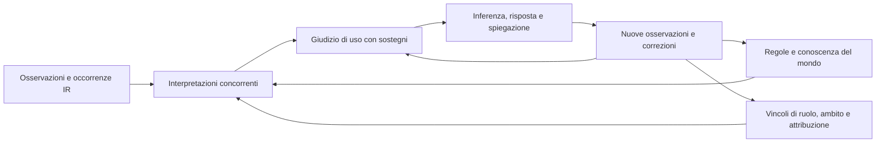

# L4 — la coerenza dell'apprendimento con la comprensione

**Piano di indirizzo e progettazione operativa, 26 settembre 2026. Stato:
parziale; audit sul commit `af2076c4`; ⛔ RIORIENTATO da F. lo stesso giorno
(vedi l'HANDOFF): si lavora sul cuore di L4, senza una fase di fix preliminari
di L1–L3.** L4-0 ha un banco esplorativo e L4-1 una prima protezione delle
lezioni; i rispettivi gate non sono chiusi e non sono il prossimo lavoro.
Nasce dalla «domanda delle domande» di F. alla fine del giro di grammatica:

> *«il meccanismo di apprendimento di parrot0 è consistente con la sua crescita,
> cioè ciò che impara dalla grammatica si innesta nel set di regole che parrot0
> usa per operare la comprensione?»*

La risposta misurata è stata **no, non in generale**: l'apprendimento è coerente
quando innesta un MEMBRO in una regola che esiste (un plurale, un lemma, una
contrazione, un verbo per contatto); non lo è quando la lezione riguarda la
REGOLA stessa, né quando il membro entra senza le condizioni della regola. Poi F.:

> *«ma nominarle abbiamo visto con L3 che non è un requisito essenziale; il
> derivato della mia domanda deve dare il via a l4-upgrade.md, cioè la coerenza
> dell'apprendimento a tutto campo dentro i meccanismi di comprensione»*

Prosegue [l3-upgrade.md](l3-upgrade.md) (il contatto come canale, §12 «imparare
una lettura attraverso le sue conseguenze») e [l2-upgrade.md](l2-upgrade.md) (gli
schemi, che restano il livello di sotto). Si appoggia sul contesto come rete di
percorsi di [frontier-kb-natural-dialogue.md §19](frontier-kb-natural-dialogue.md),
sul [MANTRA](../../MANTRA.md) (#2, #17, #18, #19, #20) e sulle tre sessioni del 26
settembre, i cui fallimenti sono il banco di partenza
([train-the-learning-process.md](train-the-learning-process.md), sezione
PRIORITARIO).

> **In una frase.** L1–L3 hanno reso possibile *imparare* (per fatto, per schema,
> per contatto). L4 rende l'apprendimento **coerente con ciò che parrot0 fa per
> capire**: ogni cosa imparata — fatto, lettura, regola, procedura — deve entrare
> nella **stessa rete di inferenza** che la comprensione percorre, nel punto in
> cui cambia qualcosa e con le condizioni sotto cui vale; e chi impara trova quel
> punto **facendo girare la propria comprensione sulle conseguenze della
> lezione**, non attraverso un nome.

> **Niente nomi obbligatori (F.).** Nominare una regola può essere un *risultato*
> di L4, mai un *requisito*. L3 ha mostrato che «hails from» diventa un verbo di
> `born_in` senza che nessuno nomini niente: il punto d'innesto si trova per
> contatto con ciò che la comprensione già fa. L4 generalizza quel gesto a tutte
> le lezioni.

---

## HANDOFF — da dove si comincia

### ⛔ La direzione (F., 26 settembre 2026) — prevale su tutto il resto del piano

> *«se L4 funziona e lo traguardiamo sarà possibile correggere i difetti di L3
> usando L4, perché proprio quelle lezioni ricadranno nella comprensione; e
> quindi tutti i tentativi di affinare L1 L2 L3 prima di poter fare L4 sono
> sbagliati. L'unica ragione per fixare problemi di quelle pratiche è
> giustificata solo se nel tentativo di costruire L4 viene fuori che un bug ci
> sta impedendo di completare. L4 si inizia su L3 non funzionante
> correttamente, ma quel giusto che serve per avere l'adattabilità.»*

**Che cosa è L4.** Lo strato attraverso cui ciò che si insegna **cade nelle
regole di comprensione**. Si cerca il punto in cui una regola grammaticale che
parrot0 già usa, se reinsegnata da fuori, **appare per come è**: L4 la trova,
la riconosce come *quella* regola e non la duplica. Da lì L4 **espande** le
regole grammaticali come farebbe chi ragiona sulle regole dall'esterno: una
condizione, un'eccezione, una composizione. La modifica entra nella stessa
regola che la comprensione esegue. Il lavoro vero riguarda **come la KB è
organizzata e costruita**: il suo essere viva è la garanzia che L4 si possa
fare, e dove non lo è, va detto.

**La conseguenza operativa.** I difetti di L1–L3 non si curano prima di L4:
quando L4 funziona, le loro correzioni sono lezioni che ricadono nella
comprensione, e si curano *attraverso* L4. Un fix a L1–L3 è ammesso solo come
**blocco dichiarato**: si stava costruendo un passo di L4, un difetto preciso
lo impedisce, e il resoconto nomina il passo bloccato. Il caso «gauge» (R3),
la persistenza (R6), le procedure (R7) e la rifinitura del banco L4-0 restano
nel repertorio dei §§1 e 6: **non sono lavoro preliminare**.

### Il primo circuito: una regola che opera, reinsegnata ed estesa

1. Leggere [MANTRA](../../MANTRA.md), [PRINCIPLES](../../PRINCIPLES.md), il
   §2.4 («la regola deve essere sia operante sia discutibile») e il §2.7 («la
   prova di apertura della rete»). Sono il cuore; il resto del §2 è contesto.
2. **Scegliere una regola grammaticale che oggi opera nella comprensione.**
   Candidata: l'inversione soggetto-ausiliare nelle domande (modali e
   do-support), che è anche il controesempio del §0. In alternativa a/an (R4).
3. **Censirla: dove vive davvero.** Clausole KB, classi, `turn_form`, e quanto
   di essa sta ancora nel C. Poi chiedersi se la KB la espone come **regola
   discutibile**: che cosa conclude, su quali ruoli, a quali condizioni. Punti
   di partenza: `kb_clause/4`, `kb_clause_arg/4`,
   [clause-content.p0](../../kb/core/clause-content.p0),
   [english-grammar/](../../kb/core/english-grammar/). Se una parte non è
   raggiungibile, quello è il primo lavoro sulla KB, e va nel C_TODO solo se
   è davvero un residuo del motore.
4. **Reinsegnarla a parole e farla riconoscere.** Una lezione naturale come
   quella del §0 («To make a question with can, put can before the subject»)
   deve essere confrontata con la regola che opera, attraverso le sue
   **conseguenze**: un esempio pertinente, una domanda che la regola legge. Il
   risultato atteso è «questa è una regola che già uso, qui», con la portata
   provata. Non un fatto, non un falso «già lo faccio» su una domanda estranea
   (la conferma su «Paris» del §0 è il primo rosso di questo passo).
5. **Estenderla da fuori.** Una seconda lezione aggiunge una condizione o un
   membro che la regola non ha, e **cambia la stessa regola** che la
   comprensione esegue: la lettura cambia al turno dopo, senza ricompilare, e
   la regola modificata si può interrogare e ritirare.
6. **Il prodotto collaterale è un censimento**: per le regole grammaticali che
   la comprensione usa oggi, quali sono vive (visibili, confrontabili,
   modificabili) e quali no, e perché. È la garanzia, o la mancata garanzia,
   che L4 si possa fare, e orienta il lavoro sulla KB.

Fermarsi se manca una prova: consegnare il gap riproducibile e il prossimo
punto d'innesto. Non aggiungere la risposta attesa a mano e non cambiare la
sonda solo per ottenere verde.

**Non costruire un supervisore L4 sopra lettori incoerenti.** Se l'apprendimento
usa una rete per approvare una lezione e la comprensione ne usa un'altra per
rispondere, il controllo può diventare più sofisticato senza che parrot0 diventi
più coerente. La modifica deve raggiungere le regole che i lettori usano.

**Nota storica.** La revisione di audit metteva al primo posto L4-3 + L4-4a
(«gauge»). Il 26 settembre è stata abbozzata una cura: legare la qualifica
«Reading X as Y» all'uso provato dell'ipotesi invece che alla menzione.
Nessuna modifica è stata fatta e il lavoro è sospeso per la direzione qui
sopra. La diagnosi resta nel §6, sotto L4-3.

## Censimento 1 — l'inversione nelle domande (26 settembre, su `6ebbe0f1`)

Passo 3 del primo circuito. Domanda: la regola «la domanda si fa mettendo
l'ausiliare prima del soggetto» esiste nella KB come **oggetto** che una
lezione può trovare, confrontare ed estendere?

**Risposta: no.** La regola opera, ma è sparsa in pezzi che non si conoscono
fra loro, e il pezzo che compone la proposta sta nel C.

| pezzo | dove | che cosa fa | è una regola discutibile? |
|---|---|---|---|
| riconoscere la domanda | `turn_opens_question/1`, [grammar.p0](../../kb/core/grammar.p0) | il primo nodo è in `auxiliary/1` (o `question_word`, `clause_copula`, …) | KB, classe aperta; ma è un test di **posizione**, non dice che cosa si è spostato né da dove |
| lo stesso, secondo consumatore | `polar_opener(W) :- auxiliary(W)`; C `p0_turn_is_polar` | chiede alla KB solo del primo token | come sopra |
| ricomporre la proposta (polare generica) | C `p0_polar_reply`, `10-memory-knowledge.c` | prova **ogni coppia** di token ed entità del turno contro un predicato scelto altrove; unico gancio grammaticale `subject_before_verb_question/1` ← `aux_question/1` | **no**: «ausiliare, soggetto, verbo nudo, oggetto» non è scritto da nessuna parte; è una ricerca nel C (C5) |
| «can» affermativo e interrogativo | `turn_form(ability_stated, …)` e `turn_form(ability_polar, …)`, [messages.p0](../../kb/core/messages.p0) | due forme **scritte a mano e indipendenti**: `slot(subject), class(ability_marker), rest(object)` e `text("can"), slot(subject), rest(object)`, stessa relazione `ability_of` | i pezzi sono KB e interrogabili, ma che la seconda sia la prima con il modale spostato **non è rappresentato**; la polare usa il letterale «can», non la classe |
| altri modali | — | nessuna forma per «could», «will», «must», «should» | assenti |
| do-support | `aux_question/1` e `do_support_verb/1` (stessi tre membri, due classi); `auxiliary_chain_shape(do_support, base, do_support)` in [reading.p0](../../kb/core/english-grammar/reading.p0); `gap_np_verb_trim` | l'affermazione «S stores O» è letta da `extract_frame`; la domanda «does S store O?» ha bisogno di una cue `answer_frame` | due conoscenze diverse per la stessa relazione, fra affermazione e domanda (R5 sulla grammatica) |
| catalogo delle costruzioni | `construction_family`/`construction_role` in [constructions.p0](../../kb/core/english-grammar/constructions.p0) (modal, negative_inversion, conditional_inversion…) | consumato solo da `construction_role_required` e dalle viste di debug | **descrive, non opera** |
| la modalità come contenuto | `ability_of(S, testo)`, `can_do/2`, `can_fly/1` | tre rappresentazioni della capacità | «Can a penguin fly?» non raggiunge `can_fly/1` |

**Comportamento misurato** (KB `agi` completa, processo nuovo):

- «A lathe can cut steel.» → «Held», e «Can a lathe cut steel?» → «Yes.». Invece «Could…?» e «Will…?» → muro.
- «A spring stores energy.» → «Learned», ma «Does a spring store energy?» → «I don't understand that yet.». «Did…?» e «Must…?» → muro. La base aveva già `stores(spring, energy)`.
- «Can a tern fly?», «Can a penguin fly?» → «I don't know whether…», con `can_fly/1` in KB.
- «A welder must wear a mask.» → muro; «Must a welder wear a mask?» → letta come «welder wear is mask».
- Lezione del §0 con «can» e poi «Can a lathe cut steel?» → «Yes. … something I already do». Con «must» l'esempio è **letto male** («welder wear is mask») e la risposta dice lo stesso «I already do». È il rosso del §0 in forma più netta: la conferma poggia sul fatto che l'esempio ha ricevuto una risposta, non su una regola.

**Che cosa dice il censimento su L4.**

1. Oggi una lezione che descrive l'inversione **non ha niente con cui
   confrontarsi**: la regola che opera non è un oggetto. Nessun supervisore
   posto sopra lo può cambiare; per primo va cambiato il modo in cui la
   regola sta nella KB.
2. Il punto vivo più vicino sono le `turn_form`: pezzi in KB, già letti da
   altri processi (`conduct-lessons.p0` interroga `turn_form(F, N, text(T))`).
   La coppia `ability_stated`/`ability_polar` mostra l'inversione come
   **permutazione di pezzi**, con lo stesso atto e la stessa relazione. È lì
   che l'inversione può diventare una regola: la forma interrogativa si
   **deriva** dalla dichiarativa (il pezzo del modale va prima dello slot del
   soggetto) invece di essere scritta a parte.
3. Con l'inversione derivata, la lezione del §0 ha un bersaglio. La si
   confronta con le **conseguenze** della regola: il suo esempio viene letto
   dalla forma derivata, con il modale della lezione in testa? Allora «questa
   è la regola che uso, per can». Con «must» la regola c'è ma nessuna forma
   dichiarativa porta «must»: non «già lo faccio», ma il residuo esatto, cioè
   quale forma o quale relazione manca.
4. **Estendere da fuori** diventa allora cambiare una condizione della stessa
   regola: quali marcatori, quali forme dichiarative, oppure il do-support
   come caso con il verbo alla forma base (`verb_form/3`). Nessuna forma
   interrogativa nuova scritta a mano.

**Blocchi possibili, da dichiarare solo se il circuito li incontra:** la
ricerca a coppie di `p0_polar_reply` (se la polare generica deve passare per
la regola derivata); le tre rappresentazioni della capacità (`can_fly/1`).
Non sono lavoro preliminare.

### Incremento 1 — fatto (26 settembre): l'inversione è una regola KB

`ability_polar` non esiste più. In [grammar.p0](../../kb/core/grammar.p0),
accanto a `polar_opener`:

- `question_inversion(Dichiarativa, Classe, Ausiliare, Domanda)` è **la
  regola**. Prende una forma dichiarativa il cui primo pezzo porta il soggetto
  (`inversion_subject_piece/1`) e il secondo è `class(M)`. Per ogni membro di
  M che è un ausiliare (`auxiliary/1`), deriva la domanda: l'ausiliare in
  testa, il soggetto dopo, il resto invariato. L'atto viene da
  `inversion_question_act/2` (`assert_relation` → `answer_polar`).
- `inverted_form/2` è la proiezione che i lettori consumano,
  `materialized_view` ricorsiva (mantra #20). `turn_form`, `turn_form_mood`,
  `turn_form_act`, `turn_form_priority` e i vincoli dei pezzi
  (`turn_form_slot_class`, `turn_form_slot_form`) delle forme derivate si
  deducono da lì.
- Ciò che è proprio della domanda resta dichiarato: la risposta vuota
  (`ability_unknown`) e le tre cessioni (deittico «you», verbi del parlare,
  domanda di decisione), ora agganciate a `inverted_form(Q, from(ability_stated, W))`.
- Il C non è stato toccato. Il lettore delle forme vede le forme derivate
  perché chiede forme e pezzi al solver.

**Misure.**
- Comportamento identico su 15 turni di confronto, con una sola differenza:
  «Was Hamlet written in 1600?» passa da «I cannot settle that» a «Yes.».
  È una conseguenza **non scritta da nessuno**: la stessa regola ha derivato
  la domanda anche da `year_stated` («was»/«were»). «Was Hamlet written in
  English?» resta com'era, perché il vincolo sull'anno viaggia con il pezzo.
- Tempo: senza vista 6–17 s per turno; con la vista `turn_form` costa 13 ms
  e il turno 0,58 s.
- `make soft-test` verde in 3 s. `turn_thefts`, `living_capabilities` e
  `selflimits` hanno gli stessi fallimenti con e senza la modifica: sono
  preesistenti.
- Cricchetto meccanico
  [question_inversion.p0t](../../tests/p0t/language/question_inversion.p0t),
  in `make test`, 9/9: la domanda si legge; `year_stated` apre la sua domanda
  con il vincolo; `!assert ability_marker("could")` apre «Could…?» nello
  stesso processo e l'ablazione la richiude.

**Due trappole del motore pagate qui, valgono per la prossima vista.**
1. Il congelamento enumera solo arità **1 e 2**: una vista a 4 argomenti
   resta sempre derivata, in silenzio.
2. `kb_fact` e `apply` nel corpo **spengono** la clausola durante il
   congelamento. Si chiede `turn_form` direttamente, lasciando al motore la
   ricorsione, e `apply` si dichiara con `view_apply_resolved/1` più
   `view_depends/2` sulle classi raggiunte.

### Incremento 2 — fatto (26 settembre): la lezione si confronta con la regola

In [language-lessons.p0](../../kb/core/language-lessons.p0), §3-bis e §4.

- **Allineamento per parti nominate.** Una forma ha parti che la lingua sa
  nominare: il modo (`form_part_word(question, mood(question))`), i pezzi
  (`subject`), le ancore, l'ordine (`form_order_word(before, before)`). La
  lezione **colloca** qualcosa: `lesson_placement/4` prende ciò che sta prima
  della parola d'ordine e il pezzo nominato dopo. `lesson_form_target/4`
  trova le forme del modo nominato che hanno quell'ancora e quel pezzo
  **nell'ordine detto**: è una conseguenza strutturale verificata sulla forma,
  non una lettura della regola descritta. Le forme derivate da
  `question_inversion/4` sono forme come le altre.
- **Il residuo.** Se la lezione colloca un ausiliare e nessuna forma di quel
  modo si apre con esso, `lesson_residue_operator/2` lo nomina: la regola c'è,
  manca l'affermazione da cui derivarla.
- **La ricevuta dell'esempio.** Unica riga di C:
  `turn_form_read(current_turn, Forma)`, pubblicata dal lettore delle forme
  quando una forma combacia e ripulita a inizio turno, come `turn_translated`.
  È un'osservazione, non una decisione (mantra #18: una primitiva motivata, non
  una migrazione).
- **Il giudizio sull'esempio**:
  - letto dalla forma bersaglio → «I read it with that rule…»;
  - dice l'ausiliare ma letto per altra via → «I didn't read it with «X»…»;
  - non dice l'ausiliare → non è un esempio di questa lezione: silenzio, la
    lezione resta aperta;
  - lezione non allineata e risposta data → «I can't tell yet whether I did
    it the way you described». Il falso «already» del §0 non si produce più
    su nessun ramo.

**Misure** (KB `agi` completa, processo nuovo):

| turno | prima | ora |
|---|---|---|
| lezione «can» | chiede un esempio | «It matches a rule I already use: I ask questions by putting «can» before the subject.» + chiede un esempio |
| «What is the capital of France?» | «Paris. … I already do» | «Paris.» (non è un esempio: lezione aperta) |
| «Can a lathe cut steel?» | — | «Yes. That was your example, and I read it with that rule…» |
| lezione «must» | chiede un esempio | «…no statement I can read has «must» in that place, so I can't do it that way yet.» |
| «Must a welder wear a mask?» (letta male) | «… I already do» | «… I didn't read it with «must» before the subject…» |
| lezione do/does/did (G2) | chiede un esempio | residuo su «do», «does», «did»: il do-support non passa ancora da `question_inversion` |

Cricchetto [lesson_meets_rule.p0t](../../tests/p0t/language/lesson_meets_rule.p0t),
in `make test`, 9/9. `soft-test` verde; `question_inversion.p0t` 9/9.

**Residui osservati, non curati (non bloccano il circuito):**
- La lezione in italiano («Per fare una domanda con can, metti can prima del
  soggetto») non è riconosciuta come lezione sulla lingua, perché
  `language_term/2` è solo inglese, e diventa un fatto spazzatura (R1).
- Il do-support è letto dalla ricerca a coppie di `p0_polar_reply`, non da una
  forma: per portarlo nella regola serve una forma dichiarativa con la
  morfologia del verbo alla forma base (punto 4).
- La frase del riconoscimento dice il modale ma non ancora **da quali
  affermazioni** deriva la domanda (`inverted_form(Q, from(D, W))` lo sa già).

**Prossimo passo: il punto 4, estendere da fuori.** Con «must» la lezione
arriva al residuo esatto. La lezione successiva deve poter **dare** ciò che
manca, cioè un'affermazione con «must», in lingua naturale. La stessa
`question_inversion` deve allora derivarne la domanda nello stesso processo,
e la lezione su «must» deve passare dal residuo al riconoscimento. La prova
meccanica esiste già (`!assert ability_marker("could")`, incremento 1); manca
la via **parlata**.

## 0. Audit del punto di partenza: esistente, limite, lavoro nuovo

I simboli nella tabella esistono a `af2076c4`; cercarli con `rg -n` nei file
indicati, perché i numeri di riga cambiano. Le sezioni successive descrivono
contratti da raggiungere, salvo dove compare una verifica esplicita.

| punto d'ingresso verificato | contratto effettivo e conseguenza per L4 |
|---|---|
| [coherence-bench.py](../../scripts/coherence-bench.py), `main`, `verdict`, `service` | Un processo per batteria, lezioni cumulative, riconoscimento di `already` per sottostringa, confronto della prima frase per diversi contrasti. È un indicatore esplorativo, non ancora una prova causale. |
| [grammar.json](../../tests/coherence/grammar.json) | 22 casi, non 25: mancano G6, G8, G16. Il gate delle 100 lezioni meccaniche e P1–P14 non è automatizzato qui. |
| [language-lessons.p0](../../kb/core/language-lessons.p0), `turn_is_language_lesson`, `language_example_read` | Riconosce termini metalinguistici su `turn_surface_token/4`, con il requisito `turn_prose_long`; conserva il numero del turno e una finestra di 3 turni. **Non conserva un legame semantico lezione→esempio**: una domanda risposta, escluso `wrong_suspect`, basta alla conferma. |
| [turn-frames.p0](../../kb/core/turn-frames.p0), `turn_prose_long`, `prose_min_words` | La soglia è 9. Abbassarla globalmente per G18/G22 allargherebbe anche altre rivendicazioni. La brevità di una lezione va risolta nel suo riconoscimento, provando i contrasti. |
| [kb.c](../../src/kb.c), `derivation_door`; [derivation.p0](../../kb/core/derivation.p0) | `kb_derivation(D, Goal, 0, N)` descrive una **prova riuscita**, con le dipendenze a indice 1…N. Non restituisce il primo sottogoal fallito né suggerisce una riparazione. Gli ID `derivation_<n>` sono temporanei, in un anello, e non sono riferimenti persistenti. |
| [input-structure.p0](../../kb/core/input-structure.p0), `input_assertion_store`, `input_frame_reading` | Scrive `semantic_proposition/1`, `semantic_binding/3` e provenance; le domande IR consumano davvero questi legami. Non sono tutti «metadati innocui», anche se il banco li conta in `service`. |
| [document-claims.p0](../../kb/core/document-claims.p0), `normalization_origin`, `claim_current_reading`, `reading_depends_on`, `reading_current` | Esiste già la separazione fra osservazione, interpretazione versionata e impegno sul mondo. È un precedente da riusare e collegare al turno, non la prova che tutte le letture siano già revisionabili. |
| [contact.p0](../../kb/core/contact.p0), `contact_candidate`, `contact_bridge`, `construction_frame`, `answer_frame` | Le ipotesi alimentano i lettori condivisi, con sostegni/ritiro/controesempio. Il ponte per nome e relazione non è ancora una prova di applicabilità a **questa occorrenza**. Qui cercare R3, prima di inventare un lessico parallelo. |
| [procedures.p0](../../kb/core/procedures.p0), `proc_run`, `proc_from`, `step_term`, `run_step` | L'interprete KB e il passo `op(apply, …)` esistono già. Un passo apparentemente saltato può non essere stato imparato; non è prova che manchi la composizione. |
| [10-memory-knowledge.c](../../src/brain/10-memory-knowledge.c), `p0_indef_article` | La KB sceglie l'articolo, ma riceve **solo la prima lettera**. Il collo di bottiglia è l'informazione passata alla decisione: una nuova eccezione fonetica non può distinguere due parole con la stessa iniziale. |
| [main.c](../../src/main.c), ramo `/restore`; [kb.c](../../src/kb.c), `kb_save_routed` | Il banco ricarica la KB **nello stesso processo**, senza un nuovo avvio. Il salvataggio instradato seleziona `KB_SESSION`; non basta che il delta sia visibile come ipotesi o riflessione perché persista. |
| [10-memory-knowledge.c](../../src/brain/10-memory-knowledge.c), `note_class_conflict`; [kb.h](../../src/kb.h), `kb_is_conflicted`, `kb_assert_neg_only` | Il conflitto di classe viene già segnalato durante alcuni apprendimenti; esistono negazione esplicita e conflitti ground. L4-8 deve unificare/estendere questi percorsi, non dichiararli assenti. |
| [debug.p0](../../kb/core/debug.p0), `debug_paradox`, sonda 44; [kb.c](../../src/kb.c), `kb_note_inference` | Il registro dei paradossi esiste; gli eventi di inferenza vengono pubblicati fuori dalla prova attiva. Nessuna promessa implicita di conservazione delle due prove, revisione, persistenza o dialogo sui conflitti. |

### 0.1 Evidenza riprodotta durante questa revisione

Sul binario con SHA-256
`2585bac9c4f66c9d97186cac39aa3595ffd8e250b2d4f19cc6a5c318dffdbac3`,
profilo `agi`, lingua `en`, copie complete in `/tmp`, nessun errore di parsing
nel boot della sonda dialogica:

- Il sottoinsieme **G2,G9**, in quest'ordine, dà **1/2** nel contatore attuale:
  G2 «sovrapposizione riconosciuta», G9 «non innestata, niente scritto».
  Questo non rivalida il vecchio 3/22 e non certifica la coerenza di G2.
- In un processo nuovo, senza salvare il banco precedente, si riproduce:

```text
> To make a question with can, put can before the subject.
< I read that as a rule about how the language works, not as a fact about the world, so I keep nothing from it yet. Can you show me an example?
> What is the capital of France?
< Paris. That was your example, and I already read it that way, so what you described is something I already do, at least here.
```

La risposta geografica è corretta; **la conclusione sulla lezione non è
giustificata**. È il primo rosso di L4-1. Non si cura aggiungendo «capital»
alle esclusioni: serve una relazione fra la lezione e l'esempio.

### 0.2 Numeri da non confondere

`131/100 = 1,31` è il rapporto storico «imparate / con problemi» della meccanica,
non una quota di successo. Le **otto** sovrapposizioni del resoconto comprendono
G1 parziale; quelle complete elencate nel banco sono **sette**. `0/22` e `3/22`
sono risultati storici del vecchio giudice (§6), non traguardi certificati.
Per un confronto valido occorrono anche la revisione della **batteria e della
KB**, l'ordine dei turni e lo stesso criterio di giudizio: lo stesso eseguibile
da solo non basta.

---

## 1. Che cosa si è misurato: le rotture di coerenza

Tre sessioni live del 26 settembre (debug PHP, meccanica di precisione,
grammatica inglese), tutte con conoscenza vera. Il dettaglio è in
[train-the-learning-process.md](train-the-learning-process.md); qui la
classificazione che fonda il piano.

| # | rottura | caso misurato | che cosa dice sulla coerenza |
|---|---|---|---|
| R1 | **la lezione su una regola diventa un fatto sul mondo** | «To make a question with other verbs, put do, does or did before the subject…» → `Learned: put do does.`; «Short adjectives make the comparative with er…» → `short adjectives make comparative`, che poi risponde a «What needs grease?» | ciò che doveva modificare la comprensione finisce nel deposito dei fatti, dove la comprensione non lo usa come regola e dove contamina altre domande |
| R2 | **la sovrapposizione non si vede** | otto regole grammaticali già operanti (do-support, modali, negazione, passivo, who sul soggetto, aggettivo attributivo, ordine SVO): nessuna lezione risponde «già lo faccio» | chi impara non si confronta con ciò che sa fare: non conferma, non estende, duplica o sporca |
| R3 | **il membro entra senza le condizioni della regola** | dopo «so it gauges thickness» ogni «gauge» è *measures* anche in «gauge blocks», «bore gauge»; «lead screw» diventa *causes* | l'innesto avviene per identità della parola, non nel punto della rete (ruolo del nodo, sintagma, forma di nascita) in cui vale |
| R4 | **la regola che la comprensione usa sta nel C** | l'articolo a/an scelto per LETTERA (`p0_indef_article` passa una lettera alla KB: «an universal quantifier»); guardie di sintagma e cancello dei concetti in parte compilati | la lezione giusta («universal starts with a consonant sound») non ha dove innestarsi |
| R5 | **due depositi della stessa cosa** | «print_r prints a readable view…»: la KB tiene `readable_view`, il deposito semantico parallelo `readable`, e la domanda risponde dal secondo | la stessa lezione produce due verità, e quale si usa dipende dal lettore |
| R6 | **l'innesto non sopravvive o non si raggiunge** | «Is a lathe a machine tool?» risponde in sessione e non dopo `/save` e riavvio; i fatti salvati sparsi per predicato in file estranei (una fresa in `physiology.p0`) | l'apprendimento vale nel processo che l'ha fatto, non nella KB che ne resta |
| R7 | **la procedura imparata non entra nelle altre vie** | «rule for X is multiply by 25.4» si esegue con «apply X to 2», ma non dentro un'altra procedura (il passo `apply` saltato), non all'inverso («What number gives 50.8…?» dirottata), non in lingua («How many millimeters are 3 inches?») | una procedura imparata è un'isola: la comprensione non la attraversa |
| R8 | **una lezione capita male resta** | «rule for rpm takes 2 inputs» → `Noted: The trip takes 2 hours.`; il controesempio «…but the cutting tool is not its product» → `not(rotate(spindle, cutting_tool))` | ciò che non si è capito non deve innestarsi: oggi diventa un fatto, a volte falso |

## 2. La tesi

La coerenza non è una proprietà di un modulo: è una proprietà del **rapporto** fra
ciò che si impara e ciò che si usa per capire. Si definisce così:

> **Una lezione è coerente quando il suo effetto (a) è prodotto dalla stessa rete
> di inferenza che la comprensione percorre, (b) cambia soltanto ciò che la
> lezione giustifica, (c) vale dove la lezione vale e non altrove, (d) resta dopo
> il riavvio, e (e) quando la comprensione ne era già capace, lo riconosce invece
> di duplicarlo.**

Da qui segue il principio operativo di L4, il seguito diretto del circuito di L3
§12.3:

> **Il punto d'innesto si trova per conseguenza.** Una lezione produce delle
> conseguenze osservabili (un esempio, una domanda che dovrebbe cambiare
> risposta, una lettura che dovrebbe cambiare). Chi impara fa girare la propria
> comprensione su quelle conseguenze **prima** di impegnarsi: se le produce già
> per una ragione pertinente, può confermare il caso nella portata provata;
> se la lettura è parziale, il residuo orienta la ricerca di un innesto, senza
> identificarlo automaticamente; se mancano le ancore, la lezione resta
> un'ipotesi e si chiede un esempio o una distinzione.

Nessun nome è richiesto: il punto d'innesto è **un percorso** della rete (una
derivazione, una lettura della IR, un passo di procedura), trovato dalla
comprensione stessa. È il «contesto a rete» di F. applicato all'apprendimento:
imparare non è aggiungere un valore a un insieme, è modificare un percorso in un
punto e con le condizioni del punto.

### 2.1 L'invariante fondazionale: conservare il significato lungo i percorsi

**KB unica non significa interpretazione unica imposta.** Significa che lettura,
apprendimento, inferenza, risposta e spiegazione possono discutere gli stessi
oggetti e le stesse giustificazioni. Interpretazioni concorrenti sono parte
della conoscenza; due copie indipendenti della stessa interpretazione sono
debito. Una diversa formulazione o un indice accelerato sono leciti se non
possono cambiare autonomamente ruoli, portata e sostegni.

Il criterio strutturale di L4 è questo: **due percorsi riferiti allo stesso
contenuto, nello stesso rispetto, devono conservare lo stesso impegno
semantico, oppure rendere interrogabile il punto del loro disaccordo.**
Non basta che diano la stessa stringa. Una risposta ottenuta da un'ipotesi e
una ottenuta da una fonte indipendente possono coincidere e avere forza diversa.
Viceversa, due risposte diverse possono essere entrambe corrette se cambia il
tempo o il referente. L'identità del predicato da sola non decide nessuno dei
due casi.



È una rete di dipendenze nella stessa KB, **non** una proposta di sei nuovi
moduli o di una pipeline irreversibile. Il contesto contribuisce alla lettura,
la lettura può chiarire il contesto, una correzione riapre entrambi.

### 2.2 Distinzioni che le regole devono poter esprimere

Prima di introdurre predicati nuovi, cercare il posto di queste distinzioni
nelle rappresentazioni esistenti. La tabella è un contratto semantico, non uno
schema di storage obbligatorio.

| oggetto | identità e funzione | punto di partenza reale |
|---|---|---|
| **osservazione** | chi ha detto quali byte, in quale episodio; rivedere il significato non riscrive ciò che è stato detto | `input_node`, `input_node_surface`, `proposition_source_record`, `claim_source_record` |
| **occorrenza** | un nodo dentro uno scope, non la parola in tutti i turni; lo stesso «gauge» può avere due ruoli nella stessa frase | `input_node(Scope, Id, …)`, `input_node_parent`, `input_node_range` |
| **interpretazione** | un allineamento fra nodi, referenti, relazione e ruoli, con operatori e ambiti; candidata, non automaticamente vera | `input_binary_assertion`, `input_semantic_frame`, `reading_choice`; per i documenti `claim_reading_record` |
| **contenuto** | ciò che viene affermato o ipotizzato, oppure la clausola con i suoi legami di variabili | `semantic_proposition`, `kb_clause/4`, `kb_clause_arg/4`, [clause-content.p0](../../kb/core/clause-content.p0) |
| **atto e sostegno** | una fonte o una prova che autorizza un uso del contenuto; due fonti non diventano un solo atto perché il contenuto coincide | `kb_act/3`, `content_act/2`, `read_support`, `kb_derivation/4`; la provenienza per bit da sola non identifica interlocutore ed episodio |
| **giudizio corrente** | quale lettura è utilizzabile per quale richiesta e perché; si può rivedere senza cancellare osservazioni o sostegni indipendenti | `contact_bridge_withdrawn`, `supersedes_in`, `reading_current`, `reading_is_stale` |

Tre limiti devono restare visibili. `content(Pred, impronta)` identifica una
clausola canonicalizzata, **non dimostra equivalenza semantica** fra regole.
`kb_derivation` conserva prove riuscite, non tutte le possibilità cognitive.
La IR attuale non rappresenta già ogni quantificatore, citazione o ambito:
`scope_requirement/4` e `commitment_at/4` in
[english-grammar/reading.p0](../../kb/core/english-grammar/reading.p0) sono
richieste di interpretazione, non una licenza a ignorare un operatore irrisolto.

**Punto critico verificabile:** `input_binary_assertion/4` conserva gli ID del
soggetto, dell'operatore e dell'oggetto; `input_semantic_frame/4` ne proietta i
valori semantici. Questa proiezione è utile, ma i consumatori L4 devono poter
risalire all'allineamento che l'ha autorizzata. Non aggiungere a ciascun
consumatore un nuovo parser per ricostruire ciò che il percorso aveva già.

### 2.3 Il contesto è una prova di applicabilità, non un'etichetta

Il §19 di [frontier-kb-natural-dialogue](frontier-kb-natural-dialogue.md)
individua il punto preciso: in alcune regole del contatto il nodo `$I` è legato
e poi ignorato. La conclusione torna a dipendere solo dalla parola. Aggiungere
`Context` come argomento, per poi confrontarlo con `mechanics` o `grammar`,
conserverebbe lo stesso errore a una scala diversa.

Per L4 una lettura è applicabile quando **esiste un percorso sostenuto** che
lega questa occorrenza ai ruoli e alle condizioni della costruzione appresa.
Vi possono contribuire struttura locale, referenti, predicazione, attributi
della relazione, impegni del discorso, ipotesi del parlante e conoscenza del
mondo. Le dimensioni pertinenti dipendono dalle regole; non sono una lista
chiusa di campi decisa da L4.

Sul caso «gauge» il percorso da correggere è:

1. `contact_shape/3` conserva una forma osservata. Questa autorizza una
   **candidatura**, non l'equivalenza globale `gauge = measures`.
2. `contact_verb_word/1` alimenta `word_is_verb_form/1`: è conoscenza lessicale
   possibile. Non deve bastare a decidere che una specifica occorrenza chiude
   un sintagma o occupa il ruolo del verbo.
3. `input_token_in_phrase/2`, `nominal_position/2`, contiguità, legame con
   soggetto e oggetto e forma della costruzione danno evidenze locali.
   `construction_frame/3`, `answer_frame/2` e i consumatori della IR devono
   conservare la distinzione fra «può essere» e «qui è stato letto come».
4. Fatto, risposta e `turn_reply_qualifies` devono dipendere dall'uso scelto
   della lettura. La sola menzione della parola non giustifica «Reading X as Y».

**Non trasformare questo percorso in una congiunzione rigida di esclusioni.**
«Non ho provato che sia un nome» non prova che sia un verbo; «il nome completo
è noto» non esclude un verbo omonimo. Anche le guardie KB possono impoverire la
cognizione se cancellano alternative prima di leggerle. Partire dalle evidenze
positive di ruolo, mantenere il residuo sconosciuto, far dichiarare alla KB
quali incompatibilità eliminano una candidata e quali lasciano ambiguità.

Attenzione anche alla circolarità: se il verbo appreso decide il confine del
sintagma, e quel confine diventa l'unica prova che il verbo appreso è corretto,
il sistema si è confermato da solo. Distinguere osservazioni e conoscenza
preesistente dalle conseguenze della candidata in esame. Il fatto che una
guardia del solver tagli il ciclo non fornisce l'evidenza mancante.

**Trasferire significa conservare la relazione fra ruoli, variando i membri.**
L'episodio d'origine è una fonte; non è una condizione da copiare integralmente.
Vincolare l'uso allo stesso soggetto impedisce di imparare; cancellare ogni
condizione produce la contaminazione. La generalizzazione deve dichiarare
quali corrispondenze astrae e quali distinzioni mantiene, restando rivedibile.

### 2.4 La regola deve essere sia operante sia discutibile

Una regola KB non è coerente solo perché si trova in un `.p0`. Deve poter essere
usata dai lettori, interrogata per i suoi ruoli e sostegni e modificata da una
lezione. L4 deve aprire la composizione delle **condizioni**, non soltanto
l'aggiunta di membri a classi già fissate (mantra #19 e #26).

Prima di proporre un nuovo schema, esplicitare: che cosa conclude, quali
variabili condividono i ruoli, che cosa lo rende applicabile qui, che cosa
costituirebbe un controesempio, e quali consumatori ne usano la conclusione.
Queste informazioni possono essere derivabili dalla clausola e da relazioni
di caratterizzazione; non vanno duplicate in una «scheda L4» che diverge dal
corpo effettivamente eseguito.

La caratterizzazione è cognitiva quando ha conseguenze: verso di una
relazione, attributo richiesto dal ruolo, valore unico **a parità di tempo e
rispetto**, portata di un quantificatore. Riusare
[the-magic-of-apply.md, Parte VII](the-magic-of-apply.md), ma non inferire tutte
le proprietà da un'etichetta generica: «tutto-parte» non autorizza ogni
transitività immaginabile e «causale» non autorizza qualsiasi catena. Le leggi
di composizione sono anch'esse conoscenza con condizioni.

Il caso a/an esemplifica il principio: passare alla KB solo `u` impedisce di
ragionare su «universal» e «umbrella». Il miglioramento è farle raggiungere la
forma e le sue proprietà fonetiche, non aggiungere un'eccezione nel chiamante.
Lettura, generazione e giudizio possono usare la stessa relazione da ingressi
diversi; ciò **non** implica che qualunque procedura sia invertibile.

**Una conseguenza non identifica da sola una regola.** Più regole possono
spiegare lo stesso esempio. L'innesto è quindi una ricerca vincolata fra
interpretazioni ammesse, non la deduzione automatica della «regola mancante».
Il delta minimo è quello semanticamente sufficiente con la portata giustificata,
non quello con meno caratteri. «Memorizza questa risposta» sarebbe spesso più
corto, ma non conserva la relazione che si sta imparando.

### 2.5 Distinguere capire, credere, usare e confermare

Non comprimere tutto in uno stato `learned`. Servono giudizi distinti:

- **lettura:** quale proposizione o modifica sta proponendo l'interlocutore;
- **sostegno:** da quali fonti/prove dipende, con quali alternative o urti;
- **applicabilità:** in quali occorrenze e richieste quel contenuto può operare;
- **impegno:** asserito, riportato, ipotetico, ritirato o ancora sospeso.

Una lezione capita può essere falsa; una frase vera può essere capita male.
Un controesempio alla lettura non è automaticamente la negazione del fatto
letto. Un fatto riportato resta interrogabile senza diventare una credenza di
parrot0. Questa separazione ha già un precedente concreto in
`normalization_origin/2`, `claim_proposition` e `claim_commitment` di
[document-claims.p0](../../kb/core/document-claims.p0): estendere quel principio,
senza presumere che il collegamento al turno sia completo.

Per la sovrapposizione servono **allineamento lezione→esempio** e sostegno della
conseguenza pertinente. La recenza è un indizio per cercare il referente del
dialogo, non la prova di quel rapporto. Il falso «Paris, quindi so già la tua
regola» del §0 manca precisamente di questo arco. Un esempio pertinente prova
al massimo «so leggere questo caso»; confermare la regola intera richiede la
portata e i contrasti che la distinguono dalle alternative.

Il sistema deve poter imparare anche quando la KB corrente sbaglia: la verità
pregressa è un sostegno da confrontare, non un veto assoluto. Una proposta
senza evidenza sufficiente resta disponibile alla discussione senza diventare
una premessa ordinaria. Non la si perde, né la si promuove per anzianità.

### 2.6 Dinamica della rete: rivedere i giudizi, conservare le fonti

La crescita non deve congelare le interpretazioni prodotte prima della
lezione. Il modello già visibile in `claim_current_reading`,
`claim_reading_record`, `reading_depends_on`, `reading_is_stale` distingue il
testo conservato dalla lettura rivedibile. È il punto d'inizio più concreto
per evitare un secondo sistema L4 di versioni e dipendenze.

La revisione deve seguire i **sostegni effettivi**: se cade H e una conclusione
C dipende solo da H, C perde quell'autorizzazione; se una prova indipendente
continua a sostenere C, C resta utilizzabile per quella prova. La dipendenza
da `absent(G)` o dall'insieme di un `aggregate(G)` può cambiare anche per
**aggiunta** di conoscenza. Non basta invalidare quando si ritira un fatto.

Un uso derivato da H non è una nuova conferma indipendente di H. Il contatto
già distingue `contact_use` da `contact_episode`; i suoi controlli non sono
ancora una prova generale di indipendenza transitiva. La provenienza deve
attraversare anche viste e letture intermedie. Una copia materializzata non è
una fonte nuova e una risposta generata da parrot0 non è un secondo testimone.

Non si richiede una chiusura globale della KB dopo ogni turno: aggiornare il
vicinato delle dipendenze pertinenti e dichiarare ciò che non è stato ancora
rivalutato. Le cache (`materialized_view`, `view_depends`) accelerano la rete;
la loro validità non può decidere il significato. La modifica della lettura,
la sua spiegazione e i risultati che ne dipendono non devono esporre versioni
incompatibili come se fossero contemporaneamente correnti.

Il ritiro cognitivo aggiunge una ragione di non usare più quel sostegno;
la pulizia di scratch/cache è un'altra operazione. `reading_stale_clause`
oggi cancella alcuni fatti: è un residuo da migrare, non la semantica finale
del ritiro L3. Anche `/save` deve conservare i legami che rendono la conoscenza
usabile e revisionabile, non solo la conclusione positiva.

### 2.7 Riflessività senza un secondo cervello

L'apprendimento usa le regole di comprensione per interpretare lezioni che
possono cambiare quelle stesse regole. Non occorre eliminare questa
riflessività; occorre renderne esplicite dipendenze e temporalità. Una lettura
ottenuta sotto una candidata H non può essere l'unica autorizzazione a rendere
H vera. Il confronto deve includere la lettura corrente e «nessun cambiamento».

La valutazione interna interroga gli stessi oggetti sulla KB completa, con
ipotesi distinguibili dagli impegni effettivi. Non chiamare ricorsivamente
`brain_respond` su frasi sintetiche come se fosse una funzione pura: può
avanzare il dialogo, imparare, produrre contatti e cambiare i referenti.
Prima riusare la separazione analisi/impegno già presente; se manca una
primitiva, dichiararne il contratto senza costruire un `Brain` vuoto.

**La prova di apertura della rete:** dopo una prima capacità, una nuova lezione
deve poter cambiare una sua condizione d'uso o una relazione fra ruoli, e
modificare lettura e spiegazione insieme. Se si può insegnare solo un altro
membro ma non discutere la condizione che lo governa, L4 ha reso estensibile
il vocabolario, non ancora coerente l'apprendimento della regola.

## 3. Le sette proprietà di coerenza (C1–C7)

| | proprietà | si verifica con | rompe se |
|---|---|---|---|
| **C1** | **un solo substrato** — ciò che si impara sta dove la comprensione legge | la stessa lezione è usata da un lettore diverso da quello che l'ha scritta | esistono due depositi (R5) o la lezione finisce in un deposito che nessun lettore consulta come regola (R1) |
| **C2** | **innesto per conseguenza** — la lezione cerca il punto pertinente attraverso la comprensione | conseguenza discriminante e cambiamento del percorso; la traccia e le derivazioni riuscite aiutano la diagnosi, non sostituiscono la prova d'uso | la lezione si scrive senza aver distinto ciò che giustifica da ciò che lascia aperto (R1, R8) |
| **C3** | **sovrapposizione riconosciuta** — se la comprensione già lo fa per la ragione pertinente, lo riconosce nella portata provata | l'esempio è collegato alla lezione e la conferma non eccede ciò che il percorso dimostra | duplicazione, conferma estranea, fatto spazzatura (R2) |
| **C4** | **condizioni ereditate** — il membro imparato porta le condizioni del percorso in cui è entrato | la stessa parola in un altro ruolo non viene letta con la lezione | innesto per identità (R3) |
| **C5** | **raggiungibilità** — ogni decisione della comprensione è conoscenza che una lezione può toccare | la lezione cambia la decisione, senza ricompilare | la decisione è nel C (R4) |
| **C6** | **persistenza e confine** — l'effetto resta dopo il riavvio e non tocca ciò che la lezione non giustifica | stessa risposta dopo `/save` e riavvio; il contrasto resta com'era | l'effetto svanisce (R6) o contamina (R1, R3, R8) |
| **C7** | **la contraddizione è uno stato, non un guasto** — quando ciò che si impara urta ciò che la comprensione sostiene, l'urto entra nel registro dei paradossi e diventa uno stato dialettico che parrot0 maneggia nel discorso e nelle inferenze (§5-bis) | la contraddizione si chiede («what contradicts what?»), si dice con le due parti e la ragione, e ha un esito dichiarato | la lezione sovrascrive in silenzio, o viene scartata in silenzio, o le due verità convivono senza che nessuno lo sappia (R5, R8) |

La procedura (R7) non è una settima proprietà: è C1+C2 applicate a ciò che si
esegue. Una procedura imparata è coerente se la comprensione la attraversa da
tutte le parti da cui attraversa le procedure che già sa: dentro un'altra
procedura, all'inverso quando l'inverso è conoscenza, in lingua quando la domanda
lo chiede.

## 4. Che cosa L4 non è

- **Non è L3 con i nomi.** Nessuna lezione deve nominare una regola perché
  l'innesto avvenga; il nome, se c'è, è un'altra faccia dello stesso percorso.
- **Non è un lettore di regole grammaticali descritte.** Una forma che legga «to
  make a question, put the verb before the subject» e scriva una clausola sarebbe
  L2 in un registro nuovo (il primo passo falso di L3 §1-bis). La descrizione
  interessa L4 per le **conseguenze** che produce: un esempio, una domanda che
  dovrebbe riuscire.
- **Non è un sistema di test.** Il banco di coerenza misura parrot0 sulla KB viva,
  con conoscenza vera; non si inventano entità, non si amputa la KB, non si alzano
  i tempi.
- **Non è un secondo deposito per ciò che si impara.** Ciò che si impara entra
  dove la comprensione legge. Proiezioni e indici restano possibili; devono
  dipendere da una sorgente semantica identificabile, senza verità autonome.

## 5. Il circuito di L4 come trasformazione della rete

**Contratto da costruire, non descrizione del comportamento attuale.** I passi
seguenti sono dipendenze logiche; non impongono nove nuovi stadi nel dispatch.

1. **Osservare e mantenere alternative.** La lezione arriva dalla IR ordinaria;
   si conservano parole, nodi, referenti, fonte e quanto non è stato letto.
   «Sta insegnando una regola» è già un'interpretazione motivabile, non un
   registro obbligatorio aperto da una formula fissa.
2. **Allineare la proposta a ciò che si comprende.** Individuare quale lettura,
   ruolo o relazione l'interlocutore sta esemplificando o correggendo. Un esempio
   può fornire le ancore; se mancano, chiedere la distinzione mancante. Non
   richiedere il nome interno del predicato e non inventare l'intenzione.
3. **Formare conseguenze discriminanti.** Chiedere che cosa cambierebbe fra
   le interpretazioni candidate, inclusa quella corrente. Un esempio compatibile
   con tutte non le distingue; una domanda estranea non è una conseguenza.
4. **Interrogare gli stessi percorsi usati nella comprensione.** Confrontare
   sostegni, ruoli e portata. Distinguere riuscita, lettura mancante, conoscenza
   mancante, conflitto e ricerca incompleta. `kb_derivation/4` documenta il ramo
   riuscito; un residuo di fallimento richiede una rappresentazione ulteriore,
   o un residuo strutturale già esposto dalla IR. Non chiamarlo prova parziale
   se nessuno lo produce.
5. **Proporre una modifica pertinente.** Un membro, un allineamento di ruoli,
   una condizione o una composizione di regole, con sostegno e portata. La
   proposta è discutibile nella KB, ma non è per questo una premessa del mondo.
   Se più modifiche spiegano l'esempio, tenerle concorrenti o chiedere ciò che
   le distingue; non scegliere la prima clausola enumerata.
6. **Valutare l'uso e i contrasti.** Lo stesso contenuto candidato deve essere
   consumabile dal lettore e dalla domanda senza due traduzioni indipendenti.
   L'effetto deve seguire le condizioni della proposta, non l'identità dei nomi
   dell'esempio. La verifica non fabbrica nuovi sostegni per se stessa.
7. **Confermare localmente, usare, chiedere o sospendere.** Si dichiara che cosa
   è stato capito e con quale limite. La conferma di un caso non proclama
   l'equivalenza di due regole; una contraddizione entra nel processo del §5-bis.
8. **Consolidare i legami, non solo il risultato.** Contenuto, condizioni,
   provenienza e giudizio d'uso devono restare raggiungibili dagli stessi
   percorsi, anche dopo il salvataggio. Un indice derivato resta ricostruibile.
9. **Rivedere alla luce della conoscenza nuova.** Invalidare i sostegni toccati,
   riconsiderare le alternative pertinenti e conservare le prove indipendenti.
   Una lezione può così far comprendere meglio anche un testo già osservato.

### 5.1 Dove cercare l'innesto prima di inventarlo

| ciò che manca | prima domanda cognitiva | aggancio verificabile |
|---|---|---|
| la forma non è riconosciuta | manca una superficie per un ruolo noto o manca la distinzione di ruolo? | `input_node_form`, `grammatical_cue`, `expression_reading` |
| la forma è nota ma viene usata male | quale condizione dell'occorrenza è stata persa? | `input_operator_node`, `input_token_in_phrase`, `reading_choice`, `contact_shape` |
| fatto corretto, domanda sbagliata | la relazione sa descrivere verso, ruoli, tipo e ambito dei suoi argomenti? | `input_frame_reading`, `directed_question_arg` in `grammar.p0`, Parte VII di `the-magic-of-apply.md` |
| stessa lezione, due risultati | sono interpretazioni alternative o copie incoerenti? Quale fonte sostiene ciascuna? | `input_assertion_store`, `semantic_binding`, `reading_fact`, `proposition_source_record` |
| una correzione non cambia la risposta | il consumatore legge ancora una copia o una lettura obsoleta? | `reading_current`, `reading_is_stale`, `view_depends`, `reading_stale_clause` |
| l'ipotesi sembra confermarsi da sola | il nuovo sostegno discende già dall'ipotesi? | `contact_independent_here`, `contact_use`, `read_support`, `derivation_depends_on` |

La domanda comune è quella del mantra #23: **quale conoscenza sulla relazione
renderebbe coerenti entrambi i percorsi?** La risposta può essere un arco o
una condizione mancante, senza richiedere un nuovo lettore o un nuovo motore.

## 5-bis. La contraddizione come stato cognitivo della rete

F., 26 settembre 2026:

> *«nel caso di contraddizione il predicato di contraddizione deve essere messo
> in campo come per i paradossi, per i loop, per i cap di soglia: anche per le
> contraddizioni ci sarà un processo che rende quello stato, ingestibile con la
> coerenza logica, uno stato dialettico gestibile.»*

**Il registro è una porta riflessiva, non la soluzione logica.** Un taglio per
budget riguarda una ricerca; una contraddizione riguarda contenuti e ambiti;
una lettura ambigua riguarda l'interpretazione. Possono condividere un registro
senza avere la stessa semantica. Il solver attuale non va descritto come se
«P e non-P» lo costringessero a derivare tutto: dispone già di negazioni
esplicite e controlli di conflitto. Non si introduce un nuovo calcolo logico
soltanto per registrare questa specie.

### Distinguere prima di dichiarare un urto

| situazione | trattamento richiesto |
|---|---|
| P e negazione esplicita dello stesso P, nello stesso rispetto | conflitto fra sostegni; conservarli e dichiararne le conseguenze |
| due classi incompatibili per la stessa entità | conflitto se l'incompatibilità e l'appartenenza sono sostenute nelle condizioni pertinenti |
| «gauge» nome in un nodo e verbo in un altro | polisemia/ruoli diversi, nessuna contraddizione da risolvere |
| due letture incompatibili della stessa occorrenza | concorrenza interpretativa; non promuovere entrambe a fatti per poi correggerle |
| due rappresentazioni discordi prodotte dalla stessa lettura | incoerenza di proiezione (R5); una sola fonte non è diventata due testimoni |
| affermazioni diverse per tempo, fonte attribuita o modalità | cercare una distinzione sostenuta; la diversità da sola non prova contraddizione né compatibilità |
| un goal non provato, o una ricerca interrotta | mancanza/incompletezza, mai prova di non-P |

### Pezzi già esistenti e collegamenti mancanti

- `contradiction/1` in [procedures.p0](../../kb/core/procedures.p0) usa
  `is_a/2` e `incompatible/2`. `note_class_conflict` usa già l'incompatibilità
  per segnalare certi apprendimenti. Il difetto è la mancata continuità fra
  rilevazione, identità, sostegni e dialogo, non l'assenza di ogni rilevatore.
- [context-scope.p0](../../kb/core/context-scope.p0) offre
  `context_effective_belief`, `incompatible_propositions` e `contradicts_across`.
  Quest'ultimo dipende da `proposition_signature/4`: nell'audit la sua
  alimentazione esplicita compare nel test `context_scope.p0t`, non è stato
  trovato un produttore generale in `src/` o `kb/`. Non assumere che ogni fatto
  appreso entri già in questo circuito. La firma deve distinguere anche gli
  argomenti e gli operatori pertinenti: stesso soggetto e stesso verbo non
  rendono «misura lunghezza» opposto a «non misura temperatura».
- `episode_contradicted`, `precedent_contradicted`, `precondition_contradicted`
  sono possibili consumatori/produttori di evidenza; non diventano equivalenti
  solo perché contengono «contradicted» nel nome.
- `own_method(contradiction)` e `own_method(non_contradiction)` descrivono una
  condotta. Non sono già il procedimento eseguibile che ricerca una distinzione.

### Il processo da raggiungere

1. Confrontare le proposizioni candidate con i sostegni pertinenti, preservando
   ruoli, polarità, ambito e attribuzione. Non fare un prodotto cartesiano di
   tutta la KB a ogni lezione.
2. Collegare l'urto alle parti e alle prove effettive. La forma
   `paradox_event(belief, contradiction, Dove, pair(Tesi, Antitesi))` è
   **proposta**, non un'API completa: occorrono identità delle parti, legame
   all'episodio, stato corrente e storia. Riutilizzare la rappresentazione dei
   contenuti; non serializzare prove intere in un argomento né salvare gli ID
   temporanei di `kb_derivation` come se fossero durevoli.
3. Cercare una distinzione motivata nella rete: tempo, senso, ruolo, condizione,
   portata o altra dimensione insegnata. **Mai inventare un contesto per
   salvare entrambe le tesi.** «Bonn» contro «Berlin» non autorizza da solo a
   inventare l'intervallo storico mancante; un'eccezione non nasce soltanto
   perché un esempio è più recente.
4. Derivare e dire l'esito: **distinzione**, **eccezione condizionata**,
   **revisione motivata**, **domanda discriminante**, **sospensione**. La
   domanda deve chiedere la distinzione che manca, senza esigere nomi interni.
5. Far dipendere gli usi successivi dall'esito: una certezza non può restare
   identica se il suo unico sostegno è sospeso. Un contenuto con un'altra prova
   valida resta disponibile, con quella giustificazione. Il registro deve
   restare interrogabile dopo la fine del turno e, per il sapere consolidato,
   dopo il riavvio.

**Rischio meccanico reale:** `kb_assert` rimuove il negativo della stessa
provenienza; `kb_assert_neg` rimuove il positivo della stessa provenienza;
`kb_assert_neg_only` è additivo. Registrare il conflitto *dopo* una scrittura
che ne ha cancellato una parte è troppo tardi. Il contratto cognitivo distingue
negazione, correzione e ritiro; l'adattatore deve preservare questa distinzione,
senza cambiare indiscriminatamente tutti i chiamanti. Pubblicare gli eventi
fuori dalla risoluzione attiva, come fa `kb_note_inference`.

## 6. Crescita per circuiti cognitivi

Le sigle originali L4-0…L4-8 restano per i riferimenti, ma non sono una sequenza
obbligatoria né otto nuovi sottosistemi. **L'ordine lo dà l'HANDOFF:** prima il
circuito regola-che-opera → reinsegnata → estesa, che attraversa L4-1, L4-2 e
L4-5. Le altre sezioni sono repertorio: si toccano solo quando bloccano quel
circuito.

### L4-3 + L4-4a — La lettura dell'occorrenza resta la stessa (repertorio, non preliminare)

**Obiettivo:** conservare le condizioni del contatto dalla candidatura al
fatto, alla domanda e alla spiegazione. Non è più il primo incremento (HANDOFF):
è un difetto di L3 che si curerà *attraverso* L4.

**Diagnosi del 26 settembre, sul checkout `4a118c23`.** Dopo «A micrometer
measures thickness, so it gauges thickness.» il chunker **non** spezza più
«height gauge», e i fatti scritti coincidono con quelli ottenuti senza la
lezione. Il danno vivo è la qualifica «Reading «gauge» as «measures»» su ogni
menzione: `turn_reply_qualifies` e `contact_word_here` in `contact.p0` usano
`contact_says`, cioè la menzione vale come uso. L'ipotesi è usata davvero solo
dal lettore a schemi (`«@S gauges @O»`) e da `answer_frame` (cue `gauge` →
`measures`). `P0FrameReading.pattern` conserva lo schema scelto, ma per i turni
non viene pubblicato: manca la ricevuta dell'uso.

Partire da `contact_shape` → `contact_verb_word` / `construction_frame` /
`answer_frame` → nodi e ruoli di `input-structure.p0` → `read_support`.
Individuare i consumatori che chiedono una proprietà della parola quando
serve un giudizio sull'occorrenza; non rendere contestuali alla cieca tutte le
classi lessicali. Conservare le osservazioni e collegare la lettura scelta
alla proiezione semantica. L4-4a non cancella `semantic_binding`: ne chiarisce
la sorgente e impedisce che il contenuto diverga da altre proiezioni.

**Chiusura del circuito:** la lezione su «gauges» permette l'uso verbale in una
frase nuova; «gauge blocks», «bore gauge» e «lead screw» mantengono i ruoli
nominali; due occorrenze della stessa forma nello stesso turno possono avere
ruoli diversi. Domanda e spiegazione seguono la lettura usata. Se manca il
fatto necessario a una domanda, si dichiara quel gap: riconoscere il verbo non
prova la verità della risposta. Un'ambiguità pertinente resta discutibile.

**Crescita successiva:** insegnare una condizione diversa e applicare la stessa
rete, senza aggiungere un ramo per quella parola o un'altra famiglia privata
di letture. La correzione deve poter cambiare l'interpretazione di un testo
conservato, non solo del prossimo prompt.

### L4-1 — La lezione e l'esempio diventano oggetti in relazione

`language-lessons.p0` è il punto di ingresso, non la soluzione cognitiva:
conserva attualmente una finestra temporale. Collegare la proposta letta
all'esempio attraverso ruoli, referenti, costruzione o distinzione discussa;
riusare la storia IR e i meccanismi di riferimento, non un riconoscitore di
frasi «di esempio» per ogni lezione.

**Primo incremento:** distinguere esempio pertinente, domanda estranea,
correzione dell'esempio e lezione concorrente. La domanda su Parigi del §0
non deve confermare la regola né consumarne arbitrariamente la richiesta.
Un successo sul caso pertinente può essere descritto come successo locale.
**Secondo incremento:** riconoscere la sovrapposizione della regola nella
portata sostenuta, senza duplicare fatti e senza assumere che un'etichetta
`answered` significhi comprensione. La lezione errata ma compatibile con un
solo esempio deve restare distinguibile da quella giusta.

### L4-2 + L4-5 — Rendere modificabile una decisione, poi una forma di regola

La prima consegna non è «imparare qualunque regola descritta». Scegliere una
relazione già usata da due percorsi e renderne raggiungibile la distinzione
che manca. L'articolo è un caso piccolo: `p0_indef_article` deve consentire
alla KB di ragionare sulla forma, non solo sulla lettera; la proprietà appresa
sul suono deve governare la resa, conservando il contrasto con «umbrella».
Una singola lezione su «universal» prova un membro, **non** insegna da sola
l'intera fonologia di «unique», «useful» o di parole mai osservate.

Poi cercare una **condizione/composizione nuova** che un esempio e una
correzione possano rendere operante attraverso i ruoli condivisi. Prima
verificare se manca il riconoscimento della domanda, la trasformazione o il
collegamento fra i due: `plural_suffix/2`, `count_plural/2` e `verb_form/3`
non sono lo stesso compito. Far riuscire «What is the plural…?» può aprire
l'accesso a una regola preesistente senza averne insegnata una nuova.

Se manca un residuo interrogabile, esporre quello specifico nella IR o nella
ricerca. Il primo ramo SLD fallito non identifica necessariamente la causa:
possono esistere altre prove, una lettura concorrente o un limite di ricerca.
Un inventore generale di clausole non è il requisito del primo incremento.

**Chiusura estesa:** una nuova condizione insegnata cambia più di un membro,
si compone con conoscenza preesistente, si può discutere e ritirare. Solo dopo
allargare a una famiglia morfologica, una sintattica e una di accordo. Queste
sono tre estensioni da dimostrare, non un unico salto architetturale promesso.

### L4-4b — La rete conserva capacità di revisione dopo il salvataggio

Separare due problemi: coerenza delle proiezioni (L4-4a) e collocazione dei
contenuti salvati. Per il primo, riusare la distinzione osservazione/lettura e
le dipendenze di `document-claims.p0`; per il secondo leggere
`kb_save_routed` e la politica delle case. Nessuna migrazione massiva dei file
è giustificata finché non si conoscono sorgente e consumatori.

**Chiusura:** una lezione resta usabile dopo un processo nuovo, e resta anche
correggibile: condizioni, fonti, ritiri e sostegni alternativi non spariscono.
Sul caso «print_r» due percorsi non possono tornare uno a `readable_view` e
l'altro a `readable` senza rendere esplicita una lettura alternativa. La materia
del file organizza la conoscenza; non determina in quali contesti essa è vera.

### L4-6 — Le procedure sono un caso della stessa composizione di ruoli

Riusare `proc_run`, `proc_from`, `step_term`, `run_step` in `procedures.p0`.
Prima distinguere un passo mai imparato da uno non eseguibile: l'operatore
`apply` esiste. Non ricostruire l'interprete in un modulo L4.

La questione cognitiva è quali ingressi, uscite, condizioni e unità rendono
componibili due procedure, e come una domanda naturale raggiunge quei ruoli.
L'inversione è una relazione soggetta a condizioni: cominciare dalle
trasformazioni numeriche con inverso definito e dominio dichiarato; moltiplicare
per zero, perdere caratteri o eseguire un ciclo non garantisce un inverso
unico. `is/2` calcola espressioni risolte, non è un risolutore relazionale
universale. Distinguere inverso numerico e relazione inversa ottenuta scambiando
due argomenti.

**Chiusura incrementale:** composizione di due procedure insegnate; poi inverso
ammissibile con controllo in avanti; poi domanda naturale con ruoli e unità.
Una domanda ambigua o una procedura non invertibile resta tale. Le 71 verifiche
storiche fallite sono un repertorio diagnostico, non un'unica capacità omogenea.

### L4-7 — L'impegno semantico segue la comprensione, dall'inizio

È un vincolo trasversale ai circuiti, non una protezione da aggiungere per
ultima. La lezione non letta conserva osservazione e ipotesi, ma non produce
una proposizione ordinaria per default. Anche una lezione capita può restare
riportata o ipotetica. Partire da `input_frame_commit` e `normalization_origin`,
verificando anche gli altri ingressi che scrivono conoscenza.

**Chiusura:** una correzione della lettura rivede la lettura, una negazione
nega il contenuto pertinente, una descrizione di regola non diventa un fatto
sul mondo. Rifiutare tutte le lezioni eliminerebbe la spazzatura ma anche la
crescita: non è un successo L4.

### L4-8 — Dal conflitto locale alla revisione motivata

Il primo incremento collega un conflitto ground già rilevabile al contenuto,
alle fonti e al registro (§5-bis). Una domanda sul contenuto mostra la tensione;
un contenuto non coinvolto mantiene le proprie prove. La nuova incompatibilità
deve essere insegnabile, non cablata nel rilevatore.

Il secondo incremento cerca **una** distinzione già rappresentabile, per
esempio attribuzione o tempo, e fa dipendere gli usi dal suo esito. Il terzo
estende alla regola e al controesempio. Non anticipare un sistema universale di
fiducia nelle fonti: quando non c'è evidenza che separi le alternative, la
sospensione dichiarata è corretta. La ripetizione non crea indipendenza.

### L4-0 — Il banco è un osservatorio della rete

**Esistente, parziale:** commit `1eb86011`; il contatore è passato storicamente
da 0/22 a 3/22 con `6a423a89`, poi `af2076c4` ha escluso lo smalltalk dalla
conferma. Questi numeri non provano ancora gli invarianti dei §§2–5.

Prima di usarli come gate, correggere i limiti di misura:

- `/restore` non è un nuovo processo; oggi il ramo di sovrapposizione non
  richiede nemmeno il successo del tenuto-fuori. Un controllo omesso è **non
  misurato**, non vero perché `all([])` restituisce vero.
- Lezioni, esempi e sonde possono imparare e influenzarsi. Separare l'effetto
  della lezione dall'effetto delle premesse degli esempi; mantenere anche la
  prova cumulativa, perché la contaminazione fra lezioni è parte del problema.
- Il contrasto è oggi eseguito **dopo** `example`, benché il commento prometta
  di metterlo subito dopo la sola lezione. Registrare entrambe le differenze,
  senza attribuire alla regola ciò che ha appena insegnato l'esempio.
- Non escludere dall'audit semantico `semantic_binding` e `semantic_proposition`
  perché sono classificati `service`. `KbWatch.added` osserva aggiunte sul
  disco, non tutte le rimozioni e revisioni, né tutto lo stato in memoria.
- Una sottostringa `already`, una risposta non vuota o un «No» costante non
  provano l'allineamento. G9 contiene nomi artificiali: può sondare una
  meccanica, non certificare collegamenti fra conoscenze reali. Non modificare
  il caso originale senza versionarlo e motivare quale confondente si rimuove.

Mantenere i transcript originali della grammatica, della meccanica e del PHP
come repertorio dei fallimenti. Le 100 voci meccaniche e P1–P14 richiedono ancora
sonde riproducibili con i loro prerequisiti; G6/G8/G16 restano fuori dai 22 casi
correnti. Il banco non deve indurre il progetto a costruire tre insegnanti
specializzati: sono tre osservazioni della stessa capacità.

## 7. Quando si può chiamare coerente l'incremento

L4 non si chiude dicendo che ogni lezione immaginabile è appresa. Per un
incremento dichiarare la classe e i limiti; dimostrare insieme:

1. **Continuità:** la lezione cambia la conoscenza che lettura e risposta
   consultano, con ruoli e condizioni preservati; la spiegazione usa i sostegni
   del risultato effettivo.
2. **Contesto dinamico:** una stessa forma può avere usi diversi; una nuova
   condizione insegnata modifica l'applicabilità senza una modifica C.
3. **Trasferimento giustificato:** un caso nuovo usa la relazione appresa;
   un caso vicino fuori portata conserva la propria lettura.
4. **Revisione:** ritiro o correzione cambia gli usi dipendenti, conserva le
   fonti indipendenti e permette di rileggere un'osservazione precedente.
5. **Riflessività:** parrot0 può discutere ciò che ha letto, il motivo della
   scelta e il residuo aperto; incertezza e conflitto non diventano certezza.
6. **Persistenza semantica:** un processo nuovo conserva non solo l'esito, ma
   i legami necessari a usarlo e rivederlo.

I risultati vanno distinti: **sovrapposizione locale riconosciuta**, **nuovo
membro**, **nuova condizione**, **nuova composizione di regola**, **ipotesi aperta**,
**errore di lettura**, **ricerca incompleta**. Una domanda onesta è un progresso
rispetto a un fatto falso, ma non si conta come regola imparata. Il denominatore
non deve escludere le lezioni fallite: riportare copertura ed esiti sul repertorio
fissato, e separatamente le prove di crescita. Una media unica può nascondere
che si impara più vocabolario senza poter cambiare una sola condizione.

La prova meccanica assert/retract aiuta a localizzare il difetto; la prova
cognitiva richiede lezione naturale, uso e correzione senza conoscere lo schema.
I casi artificiali non dimostrano connessioni nella KB reale. Quando una nuova
porta di insegnamento diventa operativa, documentarla in
[LEARN_PROTOCOL.md](../../LEARN_PROTOCOL.md), distinguendola dalle proposte.

## 8. False piste architetturali da evitare

| scorciatoia plausibile | perché impoverisce L4 | direzione corretta |
|---|---|---|
| aggiungere `Context` a ogni predicato | un'etichetta in più non ricostruisce il percorso che autorizza l'uso | condizioni derivabili da ruoli, sostegni e impegni pertinenti |
| un predicato universale enorme per ogni lettura | rende opache le distinzioni e costringe tutti i consumatori a smontarlo | oggetti collegati, viste specifiche sullo stesso contenuto e sulla stessa interpretazione |
| un supervisore che approva le lezioni | lascia separati apprendimento e comprensione | modificare i punti comuni che i consumatori percorrono |
| trasferire nel `.p0` una lista di divieti | rende configurabile il comportamento, non giustifica la scelta | evidenze positive, alternative e condizioni discutibili |
| privilegiare sempre la regola più specifica | una regola più specifica può essere falsa, priva di sostegno o riferita a un'altra lettura | specificità pertinente più prova di applicabilità e politica KB |
| usare `naf(P)` come negazione di P | confonde ignoranza, ambito e falsità; con variabili libere non lega | distinguere assenza finita, negativo esplicito, residuo e ricerca incompleta |
| cancellare tutti i derivati di un'ipotesi ritirata | distrugge conclusioni con altre prove | ritirare il sostegno, rivalutare le derivazioni alternative |
| conservare soltanto il fatto finale | perde il modo di rivederlo e di spiegarne la portata | persistere le relazioni semantiche e le fonti necessarie |
| contare ogni uso come conferma | produce auto-rinforzo senza evidenza nuova | genealogia dei sostegni e distinzione uso/conferma |
| risolvere tutti i conflitti separando contesti | rende la KB artificialmente coerente e immunizza l'errore | richiedere evidenza della distinzione; altrimenti dichiarare il conflitto |

Anche il criterio del C che si accorcia va letto semanticamente: una migrazione
di decisione deve rimuovere la decisione compilata, non spostarla in un altro
file. Le primitive nuove vanno motivate separatamente; il numero di righe da
solo non dimostra una crescita cognitiva (mantra #18).

## 9. Questioni aperte che richiedono una scelta esplicita

1. **Come rappresentare il legame fra interpretazione e clausola senza
   duplicare entrambe?** Partire da identità di contenuto, ruoli IR e versioni
   delle letture documentali; verificare sul caso R5 quali archi mancano.
2. **Come rendere il contesto compositivo senza auto-conferma?** Le evidenze
   sulla candidata devono poter dipendere da ipotesi, ma l'autorizzazione a
   consolidarla non può poggiare soltanto sulle sue conseguenze. È un problema
   di ammissibilità dei sostegni, non soltanto di ordinamento delle regole.
3. **Quali trasformazioni di regole sono già esprimibili e insegnabili?**
   Enumerare quelle richieste dal primo caso, riusando clausole e operatori;
   mantenere esplicito il limite oltre il quale si chiede invece di inventare.
4. **Come propaga la revisione attraverso i lettori storici?** Un indice di
   dipendenze perfetto nel nuovo percorso non basta se un altro legge ancora
   una copia non condizionata. La migrazione riguarda i consumatori reali.
5. **Quale politica autorizza una distinzione o un'eccezione?** Deve essere
   conoscenza rivedibile con ragioni e portata. Non presumere affidabilità
   assoluta della base, del maestro, della recenza o della maggioranza.

Non occorre risolverle tutte prima del primo circuito. Occorre non nasconderle
in un default C o in una regola KB che sceglie silenziosamente.

## 10. Riferimenti e riproduzione minima

Per la struttura cognitiva, leggere insieme:

- [L3 §12 e §19](l3-upgrade.md): conseguenze, sostegni indipendenti, ritiro;
- [frontier §19](frontier-kb-natural-dialogue.md): il nodo ignorato e il contesto
  come rete, non valore di una variabile;
- [the-magic-of-apply, Parti V e VII](the-magic-of-apply.md): natura delle
  relazioni, contratti, residui e revisione;
- [document-claims.p0](../../kb/core/document-claims.p0),
  [reading-choices.p0](../../kb/core/reading-choices.p0),
  [clause-content.p0](../../kb/core/clause-content.p0),
  [derivation.p0](../../kb/core/derivation.p0): i mattoni già esistenti e i loro
  limiti, da collegare prima di duplicare;
- [train-the-learning-process.md](train-the-learning-process.md), sezione
  PRIORITARIO, e i transcript lì collegati: repertorio storico, non specifica
  infallibile del comportamento corrente.

Ricerca iniziale, dal root del repository:

```sh
rg -n 'contact_verb_word|contact_shape|turn_reply_qualifies|read_support' kb/core/contact.p0
rg -n 'input_binary_assertion|input_semantic_frame|input_assertion_store|input_frame_reading' kb/core/input-structure.p0
rg -n 'claim_current_reading|reading_depends_on|reading_is_stale|normalization_origin' kb/core/document-claims.p0
rg -n 'derivation_door|kb_note_inference|kb_save_routed' src/kb.c
```

Il controesempio del §0 richiede soltanto i due turni riportati, in una sessione
`agi` completa. Per usare il banco senza sovrascrivere `logs/coherence-grammar.jsonl`
né riutilizzare la sua sandbox predefinita, questa ricetta esegue lo strumento
esistente su una **copia integrale**; non crea un secondo cervello interno al
ragionamento. Gli artefatti restano nella directory temporanea stampata.

```sh
make
python3 -B - <<'PY'
import importlib.util, os, pathlib, shutil, sys, tempfile
repo = pathlib.Path.cwd()
root = pathlib.Path(tempfile.mkdtemp(prefix="parrot0-l4-review-"))
shutil.copytree(repo / "kb", root / "kb")
(root / "bin").symlink_to(repo / "bin", target_is_directory=True)
if (repo / "world.p0").exists():
    shutil.copy2(repo / "world.p0", root / "world.p0")
for key in list(os.environ):
    if key.startswith("PARROT0_"):
        del os.environ[key]
os.environ.update(PARROT0_LANG="en", PARROT0_SESSION="")
spec = importlib.util.spec_from_file_location("coherence", repo / "scripts/coherence-bench.py")
bench = importlib.util.module_from_spec(spec)
spec.loader.exec_module(bench)
bench.REPO = str(root)
print("Artefatti:", root, flush=True)
sys.argv = ["coherence-bench.py", str(repo / "tests/coherence/grammar.json"),
            "--only", "G2,G9", "--sandbox", str(root / "sandbox")]
bench.main()
parrot = bench.Parrot(str(root), 10)
try:
    errors = [line for line in parrot.boot[0].splitlines() if "PARSE ERROR" in line]
    print("Errori parsing:", errors)
    for line in ["To make a question with can, put can before the subject.",
                 "What is the capital of France?"]:
        print(">", line, "\n<", parrot.say(line)[0], flush=True)
finally:
    parrot.close()
PY
```

È una sonda diagnostica del difetto, non un nuovo gate. Il giudice mantiene i
limiti di L4-0. Non copiare i suoi verdi in un resoconto di capacità senza
controllare cosa provano. Per il futuro incremento usare anche ritrattazione,
rilettura e un vero nuovo processo; non aumentare i budget per mascherare la
crescita del costo.

Prima di scrivere regole, leggere [la sintassi `.p0`](../parrot-p0-syntax.md).
Sul checkout verificato `src/kb.h` dichiara **arità 4, corpo 16**: il vecchio
limite 8 in alcuni commenti è superato. Con `assert(Pred, …)` anche il nome del
predicato occupa un argomento della chiamata. `naf` non lega variabili libere;
`eq/2` è numerico; canonicalizzare una lezione può cambiare maiuscole e forma
citata. Verificare stderr al boot prima di interpretare «nessuna soluzione»
come un difetto cognitivo. Nessuno schema proposto qui è automaticamente una
nuova API implementata.
